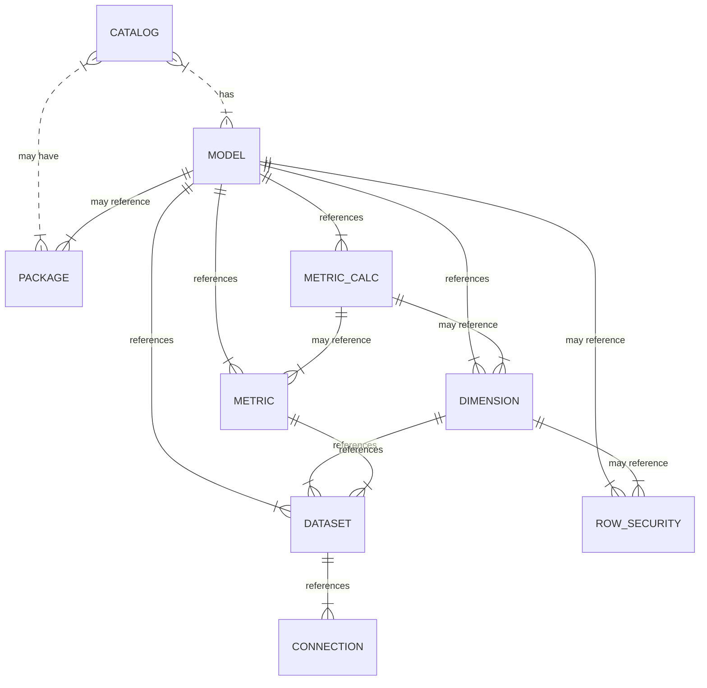

# What is SML?
Semantic Modeling Language, or SML for short, encompasses over a decade of hands-on development, solving use cases for hundreds of customers across industries such as finance, healthcare, retail, manufacturing, CPG, and more. SML covers more than just tabular use cases. At its core, it is a multidimensional semantic modeling language that supports metrics, dimensions, hierarchies,  semi-additive measures, many-to-many relationships, cell-based expressions, and much more. 

SML delivers on the following requirements:

1. **Object-oriented**: SML is an object-oriented language that promotes composability and inheritance. This allows semantic objects to be shared within other semantic objects and across organizations, supporting easy and consistent model-building.
2. **Comprehensive**: SML is based on more than a decade of modeling experience across various industry verticals and use cases. SML handles multi-dimensional constructs and serves as a superset of all other existing semantic modeling languages.
3. **Familiar**: SML is based on YAML, a widely adopted, human-readable, industry-standard syntax.
CI/CD Friendly: SML is code, so it is compatible with Git and CI/CD practices for version control, automated deployment, and software lifecycle management. 
4. **Extensible**: SML syntax can be enhanced to support additional properties and features.
Open: SML is Apache open-sourced to support community innovation and is free to use in any application or use case.

## What's in this repository?

Open-sourcing SML aims to promote the building of reusable models and semantic objects. We are making the SML specification available for public consumption and collaboration. Soon, we will add software tools to make serializations and translations from various semantic dialects easier.

We are or will be open-sourcing the following:

1. **A YAML-based Language Specification**: The SML specification is documented and encompasses tabular and multidimensional constructs.
2. **Pre-built Semantic Models**: The GitHub repository contains pre-built semantic models incorporating standard data models such as TPC-DS, common training models such as Worldwide Importers and AdventureWorks, and marketplace models such as Snowplow and CRISP. We expect to add semantic models for SaaS applications such as Salesforce, Google Analytics, and Jira soon.
3. **Helper Classes** *(coming soon)*: We will release helper classes that will facilitate the programmatic reading and writing of SML syntax.
4. **Semantic Translators** *(coming soon)*: We will release converters for migrating other semantic modeling languages to SML, including dbt Lab’s semantic layer and Power BI. Shortly, we expect to release a variety of converters to support the legacy (i.e., Microstrategy, Business Objects, Cognos) and modern (i.e. Looker) semantic modeling tools.

## SML Example
The following is an example of an SML `model` object:

```
unique_name: Internet Sales
object_type: model
label: Internet Sales
visible: true

relationships:
  - unique_name: factinternetsales_Date_Dimension_Order
    from:
      dataset: factinternetsales
      join_columns:
        - orderdatekey
    to:
      dimension: Date Dimension
      level: DayMonth
    role_play: "Order {0}"

dimensions:
  - Color Dimension
  - Size Dimension
  - Style Dimension
  - Weight

metrics:
  - unique_name: orderquantity
    folder: Sales Metrics

  - unique_name: salesamount
    folder: Sales Metrics
```

## SML Object Hierarchy
The following graphic illustrates the key SML objects and their relationships:



## SML Object Documentation

The following sections describe the different SML object types as well
as the properties available for each:

- [Catalog](sml-reference/catalog.md) - Defines the control file for a SML repository. It contains all repository-level definitions.
- [Package](sml-reference/package.md) - Defines additional Git repositories references whose objects can be used in the current repository. 
- [Model](sml-reference/model.md) - Defines the logical, business-friendly representation on top of the physical data.
- [Dimension](sml-reference/dimension.md) - Defines the logical collection of attributes and hierarchies for supporting drill-down.
- [Row Security](sml-reference/row-security.md) - Defines row-level data access rules for users and groups.
- [Metric](sml-reference/metric.md) - Defines a numeric value representing a summarized (or aggregated) column.
- [Calculation](sml-reference/calculation.md) - Defines an expression to combine, evaluate, or manipulate other metrics defined in the model.
- [Dataset](sml-reference/dataset.md) - Defines columns on a physical table or query. Columns can be defined as SQL expressions.
- [Connection](sml-reference/connection.md) - Defines a database and schema for connecting datasets to the physical data platform.

## Model Library

### Tutorial Models
1. [Internet Sales](models/tutorials/internet-sales) - a simple, single-fact model derived from the fictitious AdventureWorks retail dataset.
2. [World Wide Importers](models/tutorials/world-wide-importers) - a more complex, multi-fact model representing a fictional wholesale and distribution company.
3. [TPC-DS](models/tutorials/tpc-ds) - a complex, multi-fact model that encodes the [TPC-DS](https://www.tpc.org/tpcds/) benchmark model in SML.

### Marketplace Models
1. [Snowplow Digital Analytics Model](https://github.com/AtScaleInc/sml-models-snowplow) - Snowplow empowers organizations to create a scalable, first-party data foundation so marketing and data teams can effectively analyze and tackle Customer 360 use cases.
2. [CRISP CPG Retail and Distributor Data Model](https://github.com/AtScaleInc/sml-models-crisp-cpg-retail) - Crisp connects to over 40 leading U.S. retailers and distributors.
