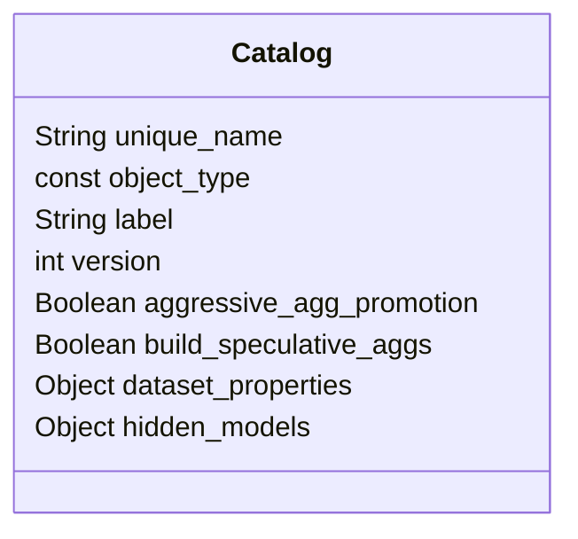

# Catalog

`catalog.yml` (the catalog file) is the control file for a SML
repository. It contains all repository-level definitions, such as the
repository name and settings for building aggregates. Each repository
must contain a file called `catalog.yml` at the root level.

Sample `catalog` file:

```yaml
unique_name: sml-models
object_type: catalog
label: SML Model Library
version: 1.0
aggressive_agg_promotion: false
build_speculative_aggs: false
hidden_models:
  - Supply Model
  - Sales Model
```

# Entitity Relationships



# Catalog Properties

## unique_name

- **Type:** string
- **Required:** Y

The name of the repository. This must be unique across all repositories
and subrepositories.

## object_type

- **Type:** const
- **Required:** Y

The type of object defined by the file. For `catalog.yml`, this must be
`catalog`.

## label

- **Type:** string
- **Required:** Y

The name of the repository, as it appears in the consumption tool. This value does
not need to be unique.

## version

- **Type:** number
- **Required:** Y

The version of SML being used.

## hidden_models

- **Type:** array<string>
- **Required:** Y
- **Added in** v1.2
- **Use case:** When deploying a composite model the referenced component models may not need to be accessible as separate models.

A list of the models that will be excluded from the deploy. Cannot reference composite models, only regular models.

## aggressive_agg_promotion

- **Type:** boolean
- **Required:** Y

Enables/disables aggressive aggregate promotion for the repository. When
enabled, all aggregates referenced by a query are considered for
promotion, regardless of whether a join to other non-preferred or
non-aggregate datasets was required.

Supported values:

- `true`
- `false`

## build_speculative_aggs

- **Type:** boolean
- **Required:** Y

Enables/disables speculative aggregates for the repository.

When enabled, the query engine automatically creates aggregate tables
that it anticipates being useful based on your models. These are
intended to improve the performance of queries from client BI tools
faster than with demand-defined aggregates alone.

**Note:** Speculative aggregates are also called prediction-defined aggregates.

Supported values:

- `true`
- `false`

## dataset_properties

- **Type:** object
- **Required:** N

Defines dataset properties to use within the repository.

Supported properties:

- `allow_aggregates`: Boolean, optional. Enables the query engine to
  create aggregates for datasets in the repository.
- `allow_local_aggs`: Boolean, optional. Enables local aggregation for
  datasets in the repository.
- `allow_peer_aggs`: Boolean, optional. Enables aggregation on data
  derived from datasets in data warehouses that are different from the
  source dataset.
- `allow_preferred_aggs`: Boolean, optional. Allow aggregates to be built
  in preferred storage.

Specify the `unique_name` of the dataset followed by the properties and
values you want to set for it at the repository level. For example:

    dataset1:
        allow_peer_aggs: true

**Note:** Datasets are typically defined at the repository level, in
`catalog.yml`; however, datasets used by a specific model (typically
fact datasets) can be defined within the model itself.
