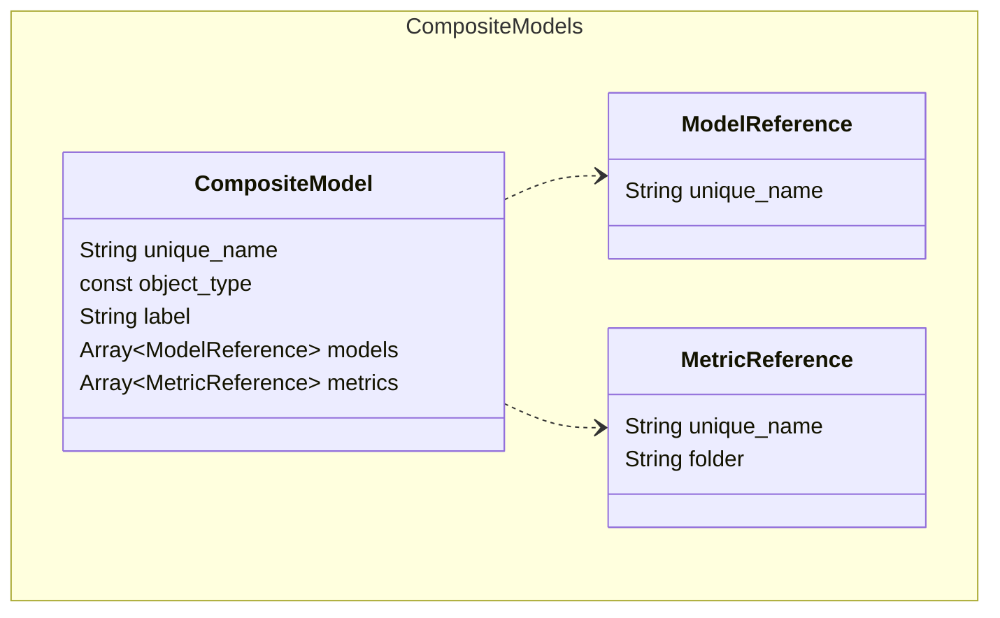

# Composite Model

Composite models are made up of multiple other models that all share a dimension, as well as calculations specific to the composite model itself. They are defined by `composite_model` files in SML.

When you deploy a composite model, all of its referenced objects are deployed as a single model. Note, however, that deployed composite models do not include the following objects from their referenced models:
- User defined aggregates
- Partitions
- Perspectives
- Drill-throughs

Sample `composite_model` file:

```
unique_name: TPCDS - Composite
object_type: composite_model
label: TPCDS - Composite
description: This is a composite model that combines TPC-DS subject-area models.

models: 
  - TPC-DS Catalog Sales
  - TPC-DS Inventory
  - TPC-DS Store Promotion
  - TPC-DS Store Returns
  - TPC-DS Store Sales
  - TPC-DS Web Sales

metrics:
  - unique_name: Store and Web Purchased Amount
    folder: Time Relative
  - unique_name: Catalog Purchased Amount Growth
    folder: Time Relative
  - unique_name: m_ws_cs_ext_sales_price_sum
    folder: Time Relative
```

# Entity Relationships



# Composite Model Properties

## unique_name

- **Type:** string
- **Required:** Y

The unique name of the composite model. This must be unique across all repositories and subrepositories.

## object_type

- **Type:** const
- **Required:** Y

The type of object defined by the file. For composite models, this must be `composite_model`.

## label

- **Type:** string
- **Required:** Y

The name of the composite model as it appears in the consumption tool. This value does not need to be unique.

## description

- **Type:** string
- **Required:** N

A description of the composite model.

## models

- **Type:** array
- **Required:** Y

A list of the models that make up the composite model. These must meet the following criteria:

- They cannot be other composite models.
- They must all have at least one dimension in common.


## metrics

- **Type:** array
- **Required:** N

A list of the calculations to include in the composite model. These must meet the following criteria:

- They must be of object type `metric_calc`.
- Each calculation’s MDX formula can only contain references to objects that appear in the referenced models.

The `metrics` property supports the following properties:

- `unique_name`: String, required. The unique name of the calculation.
- `folder`: String, optional. The name of the folder in which this calculation appears in BI tools.
