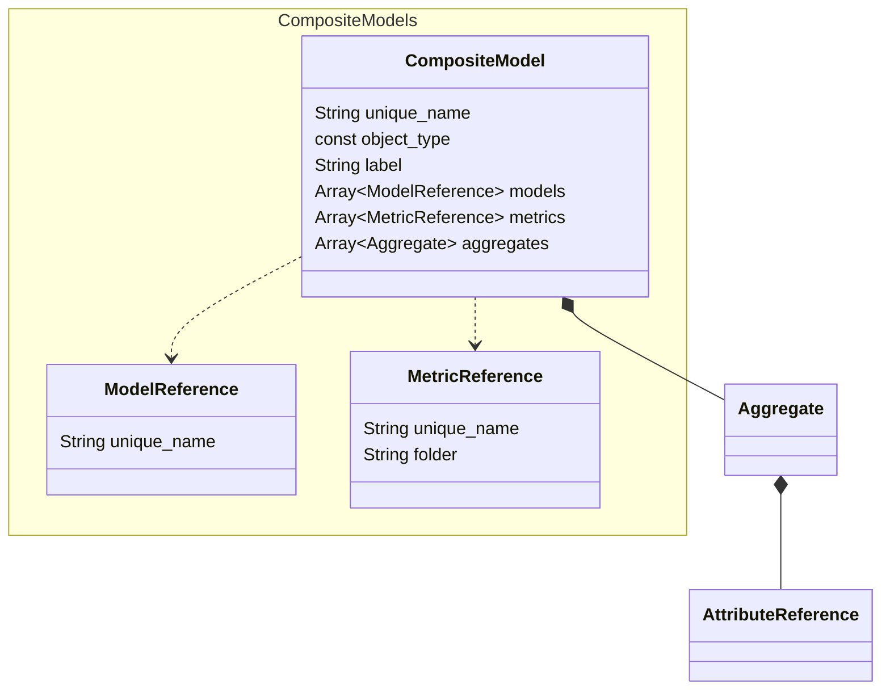

# Composite Model

Composite models are made up of multiple other models that all share a dimension, as well as calculations specific to the composite model itself. They are defined by `composite_model` files in SML.

When you deploy a composite model, all of its referenced objects are deployed as a single model. Note, however, that deployed composite models do not include the following objects from their referenced models:
- Partitions
- Perspectives
- Drill-throughs

Sample `composite_model` file:

```yaml
unique_name: TPCDS - Composite
object_type: composite_model
label: TPCDS - Composite
description: This is a composite model that combines TPC-DS subject-area models.

models: 
  - TPC-DS Catalog Sales
  - TPC-DS Inventory
  - TPC-DS Store Promotion
  - TPC-DS Store Returns
  - TPC-DS Store Sales
  - TPC-DS Web Sales

metrics:
  - unique_name: Store and Web Purchased Amount
    folder: Time Relative
  - unique_name: Catalog Purchased Amount Growth
    folder: Time Relative
  - unique_name: m_ws_cs_ext_sales_price_sum
    folder: Time Relative
```

# Entity Relationships



# Composite Model Properties

## unique_name

- **Type:** string
- **Required:** Y

The unique name of the composite model. This must be unique across all repositories and subrepositories.

## object_type

- **Type:** const
- **Required:** Y

The type of object defined by the file. For composite models, this must be `composite_model`.

## label

- **Type:** string
- **Required:** Y

The name of the composite model as it appears in the consumption tool. This value does not need to be unique.

## description

- **Type:** string
- **Required:** N

A description of the composite model.

## models

- **Type:** array
- **Required:** Y

A list of the models that make up the composite model. These must meet the following criteria:

- They cannot be other composite models.
- They must all have at least one dimension in common.

## metrics

- **Type:** array
- **Required:** N

A list of the calculations to include in the composite model. These must meet the following criteria:

- They must be of object type `metric_calc`.
- Each calculation’s MDX formula can only contain references to objects that appear in the referenced models.

The `metrics` property supports the following properties:

- `unique_name`: String, required. The unique name of the calculation.
- `folder`: String, optional. The name of the folder in which this calculation appears in BI tools.

## aggregates

- **Type:** array
- **Required:** N

The `aggregates` property in a composite model file enables you to add
user-defined aggregates (UDAs).They include metrics or attributes from different
models within the composite model.

In general, we recommend relying on the aggregate tables
automatically generated by the semantic engine. However, there are cases
that are not covered by system-defined aggregates. For example:

- **Metrics on dimensions:** The semantic engine does not generate
  aggregate tables for metrics that are local to a dimension only (a
  secondary metrical attribute in the composite model).
- **Non-additive metrics:** The semantic engine does not generate
  aggregate tables for non-additive metrics, which are useful for
  distinct counts. This is because such an aggregate table defined for
  one query would not be usable by other queries.

If you require aggregate tables that contain these types of dimensional
attributes or metrics, you should define your own manually using the
`aggregates` property.

The `aggregates` property in a composite model file supports the following
properties.

### unique_name

- **Type:** string
- **Required:** Y

The unique name of the aggregate. This must be unique within the composite model
file.

Aggregate table names used by the query engine are system-generated, but
they include the first 14 characters of the user-supplied name at the
end of the internal ID name. This name can help you identify when a
user-defined aggregate is used in a query. For example:
`as_agg_internal-id_my-uda-name`

### label

- **Type:** string
- **Required:** Y

The name of the aggregate, as it appears in the consunmption tool. This value does not
need to be unique.

### caching

- **Type:** enum
- **Required:** N

This setting will control whether the aggregate is pinned in local cache.

Supported values:

- `engine-memory`

### metrics

- **Type:** array
- **Required:** Y

A list of the metrics and calculations to include in the aggregate
definition. This is the data that is summarized in the resulting
aggregate table.

### attributes

- **Type:** array
- **Required:** N

A list of the dimension attributes to include in the aggregate
definition.

Supported properties:

- `name`: String, required. The name of the dimension attribute to
  include. These values are used to group the summarized metric data in
  the resulting aggregate table. Note that user-defined aggregate
  definitions are fixed: they do not include every level of a hierarchy
  unless they are explicitly defined.

- `dimension`: String, required. The dimension to which the attribute
  defined by `name` belongs.

- `partition`: String, optional. Adds a partition to the aggregate, and
  determines whether it should be defined on the key column, name
  column, or both. Supported values: `name`, `key`, `name+key`

  When the engine builds an instance of this aggregate, it creates
  a partition for each combination of values in the dimensional
  attributes. The number of partitions depends on the
  left-to-right order of the attributes, as well as the number of
  values for each attribute.

  Essentially, the partitioning key functions as a `GROUP BY`
  column. Queries against the aggregate must use this dimensional
  attribute in a `WHERE` clause. A good candidate for a
  partitioning key is a set of dimensional attributes that
  together have a few hundred to under 1000 value combinations.

- `distribution`: String, optional. The distribution keys to use when
  creating the aggregate table. If your aggregate data warehouse
  supports distribution keys, then the semantic engine uses the specified keys when
  creating the aggregate table.