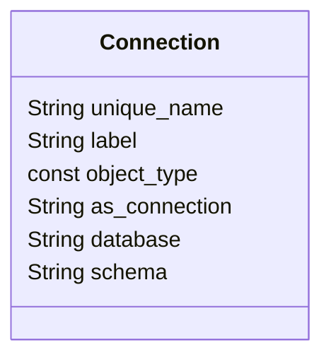

# Connection

Connection files define database connections and schemas for the
repository. These are required to import fact and dimension datasets
into your repository.

Each connection file should define a single database connection *and*
its schema. If you need to use additional schemas for the same database,
each must be defined in a separate connection file.

Sample `connection` file:

```yaml
unique_name: Connection - TPCDS
label: Connection - TPCDS
object_type: connection
as_connection: Snowflake
database: tutorial_data
schema: tpcds
```

# Entitity Relationships



# Connection Properties

## unique_name

- **Type:** string
- **Required:** Y

A unique name for the database and the schema. This must be unique
across all repositories and subrepositories.

## object_type

- **Type:** const
- **Required:** Y

The type of object defined by this file. For connections, this value
must be `connection`.

## label

- **Type:** string
- **Required:** Y

The name of the database connection as it appears in the consumption tool. This value
does not need to be unique.

## as_connection

- **Type:** string
- **Required:** Y

The name of the database connection itself, excluding the schema.

## database

- **Type:** string
- **Required:** Y

The source database used for this connection.

## schema

- **Type:** string
- **Required:** Y

The source schema used for this connection.
