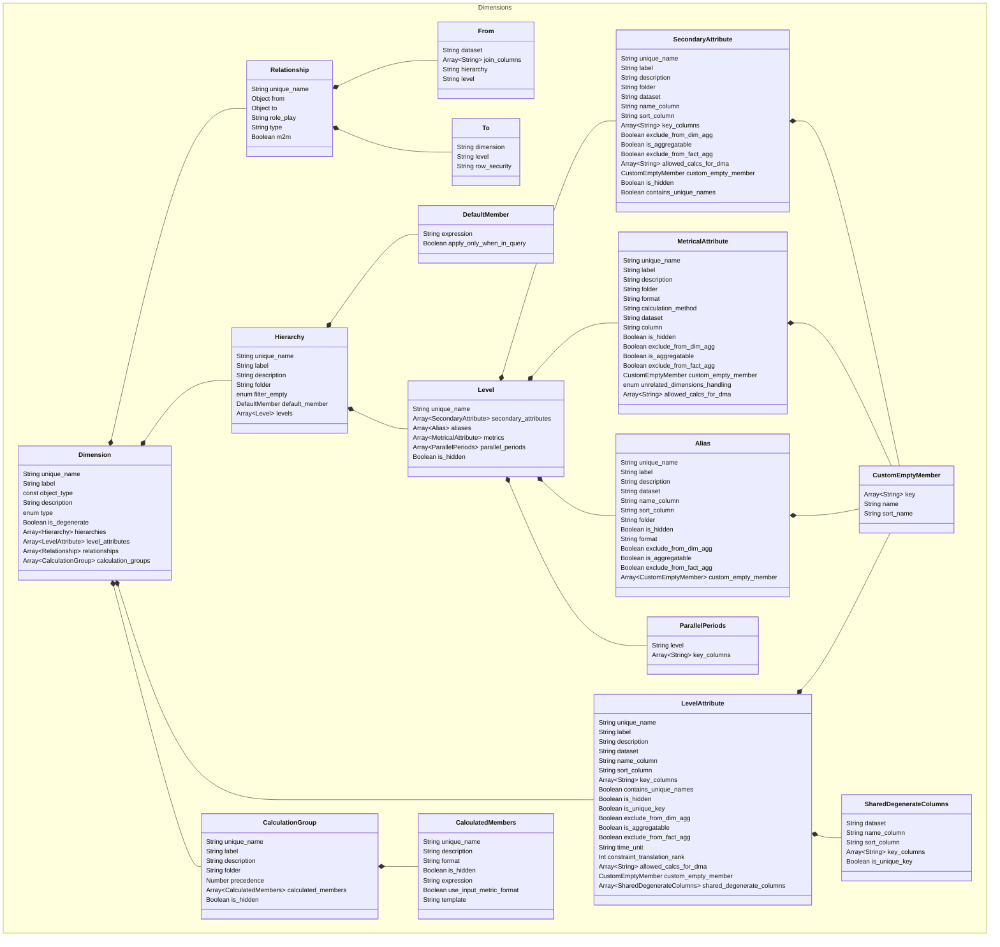

# Dimension

Dimension files define the dimensions used in the model. A _dimension_
is a logical collection of attributes that are bound to specific columns
in a source dataset. These attributes are in turn used to group and
filter metric data at query time.

SML supports the following types of dimensions:

- **Normal:** Dimensions that are based on a dataset. All data for a
  normal dimension is normalized into a single table or view. There are
  two types of normal dimensions:
- **Standard:** Can have any type of hierarchy.
- **Time:** Must have a time hierarchy.

- **Degenerate:** A dimension that is based on one or more columns in a
  fact dataset.

- **Shared degenerate:** A dimension that is based on one or more
  columns that are common to two or more fact datasets.

- **Snowflake:** A logical dimension that is composed of multiple
  underlying physical datasets.

- **Many-to-many:** Also called multi-valued. This is when a fact
  dataset row refers to more than one row in a dimension dataset. In
  SML, this is modeled by defining a dimensional bridge or junction
  table to resolve the many-to-many relationship.

Sample `dimension` file:

```yaml
unique_name: Store Dimension
object_type: dimension
label: Store Dimension
type: standard

hierarchies:
  - unique_name: Store Dimension
    label: Store Dimension
    folder: Store Attributes
    filter_empty: "yes"

    levels:
      - unique_name: d_store_country

      - unique_name: d_store_state

      - unique_name: d_store_county

      - unique_name: d_store_city

      - unique_name: Store Dimension

        secondary_attributes:
          - unique_name: d_s_floor_space
            label: Store Floor Space
            folder: Store Attributes
            dataset: store
            name_column: s_floor_space
            key_columns:
              - s_floor_space
            sort_column: s_floor_space

          - unique_name: d_s_manager
            label: Store Manager
            folder: Store Attributes
            dataset: store
            name_column: s_manager
            key_columns:
              - s_manager
            sort_column: s_manager

          - unique_name: d_s_number_employees
            label: Store Number of Employees
            folder: Store Attributes
            dataset: store
            name_column: s_number_employees
            key_columns:
              - s_number_employees
            sort_column: s_number_employees

          - unique_name: d_store_company_id
            label: Store Company ID
            folder: Store Attributes
            dataset: store
            name_column: s_company_id
            key_columns:
              - s_company_id
            sort_column: s_company_id

          - unique_name: d_store_name
            label: Store Name
            folder: Store Attributes
            dataset: store
            name_column: s_store_name
            key_columns:
              - s_store_name
            sort_column: s_store_name

level_attributes:
  - unique_name: d_store_city
    label: Store City
    dataset: store
    name_column: s_city
    key_columns:
      - s_country
      - s_state
      - s_city

  - unique_name: d_store_country
    label: Store Country
    dataset: store
    name_column: s_country
    key_columns:
      - s_country

  - unique_name: d_store_county
    label: Store County
    dataset: store
    name_column: s_county
    key_columns:
      - s_state
      - s_county

  - unique_name: d_store_state
    label: Store State
    dataset: store
    name_column: s_state
    key_columns:
      - s_country
      - s_state

  - unique_name: Store Dimension
    label: Store Number
    is_unique_key: true
    dataset: store
    name_column: s_store_sk
    key_columns:
      - s_store_sk
```

# Entitity Relationships



# Dimension Properties

## unique_name

- **Type:** string
- **Required:** Y

The unique name of the dimension. This must be unique across all
repositories and subrepositories.

## object_type

- **Type:** const
- **Required:** Y

The type of object defined by the file. For dimensions, this value must
be `dimension`.

## label

- **Type:** string
- **Required:** Y

The name of the dimension, as it appears in the consunmption tool. This value does not
need to be unique.

## description

- **Type:** string
- **Required:** N

A description of the dimension.

## type

- **Type:** enum
- **Required:** N

The type of dimension defined by this file.

Supported values:

- `standard`: Can have any type of hierarchy.
- `time`: Must have a time hierarchy.

## is_degenerate

- **Type:** boolean
- **Required:** N

Determines whether the dimension is degenerate.

## hierarchies

- **Type:** array
- **Required:** Y

Defines the hierarchies within the dimension.

Hierarchies organize the dimension attributes into categories or levels,
where each level is a subdivision of the level above. Every logical
dimension you create has at least one hierarchy with at least one level.

## level_attributes

- **Type:** array
- **Required:** Y

Level attributes are attributes associated with a particular dimension
hierarchy. Every hierarchy has a key level attribute, which is the most
granular representation of the dimension's data. Only level attributes
can be used to define relationships between datasets and other
dimensions.

## relationships

- **Type:** array
- **Required:** N

The `relationships` property in a dimension file defines the
relationships to embedded and snowflake dimensions.

**Note:** The relationships between the model's fact datasets and first
order dimensions (fact relationships) are defined in model files.

## calculation_groups

- **Type:** array
- **Required:** N

The `calculation_groups` property in a dimension file defines
calculation groups to use in the dimension.

Dimension calculation groups offer a simplifying alternative to
calculated metrics by enabling the expression of boiler-plate
calculations across multiple metrics. This feature defines calculations
as dimension members and removes static references to individual
measures.

# Relationship Properties

## unique_name

- **Type:** string
- **Required:** N

The unique name of the relationship. This must be unique within the
dimension.

## from

- **Type:** object
- **Required:** Y

Defines the side of the relationship that contains the physical dataset
that you want to connect to another dimension.

Supported properties:

- `dataset`: String, required. The physical dataset you want to link to
  a dimension.
- `join_columns`: Array, required. The column(s) within the `dataset`
  that you want to use for the join.
- `hierarchy`: String, optional. The hierarchy within the dimension from
  which the relationship should originate.
- `level`: String, optional. The level within the `hierarchy` from which
  the relationship should originate.

For snowflake relationships (as defined by the `type` property), you
only need to define `dataset` and `join_columns`.

## to

- **Type:** object
- **Required:** Y

Defines the dimension that the `from` dataset is linked to.

Supported properties:

- `dimension`: String. The name of the dimension the `from` dataset is
  linked to.
- `level`: String, required if `row_security` is undefined. The key
  level within the dimension to use for the relationship.
- `row_security`: String, required if `level` is undefined. For security
  relationships, the row
  security object that the `from` dataset is linked to.

For snowflake relationships (as defined by the `type` property), you
only need to define `level`.

## type

- **Type:** string
- **Required:** Y

Defines the relationship as either embedded or snowflake.

Supported values:

- `embedded`: A secondary relationship, or one that connects a primary
  dimension to a secondary dimension.
- `snowflake`: A relationship that connects one of several underlying
  physical datasets together to create a snowflake dimension.

## role_play

- **Type:** string
- **Required:** N

For role-playing relationships only. Defines the role-playing template
for the relationship.

The role-playing template is the prefix or suffix that is added to every
attribute in the role-played dimension. You can also specify both a
prefix and a suffix.

This value must be in one of the following formats (including quotation
marks):

- **Prefix:** `"<prefix> {0}"`
- **Suffix:** `"{0} <suffix>"`
- **Prefix and suffix:** `"<prefix> {0} <suffix>"`

For example, if you wanted to use the prefix **Order**, you would set
`role_play` to `"Order {0}"`.

## m2m

- **Type:** boolean
- **Required:** N
- **Added in** v1.2
- **Default** false

Defines a many-to-many relationship. The property is supported only for embedded relationships.

# Calculation Group Properties

## unique_name

- **Type:** string
- **Required:** Y

The name of the calculation group. This must be unique within the
dimension.

## label

- **Type:** string
- **Required:** Y

The name of the calculation group, as it appears in the BI consumer. This value does not need to be unique.

## calculated_members

- **Type:** array
- **Required:** Y

Defines the individual calculated members in the group.

**Note:** The first in the list is considered the default member of the group.

## description

- **Type:** string
- **Required:** N

A description of the calculation group.

## is_hidden

- **Type:** boolean
- **Required:** N

Determines whether the calculation group is visible in BI tools.

Supported values:

- `false` (default)
- `true`

## folder

- **Type:** string
- **Required:** N

The name of the folder in which the calculation group is displayed in BI tools.

## precedence

- **Type:** number
- **Required:** N

Update to "Precedence" explicitly defines the order of Calculation Group evaluation, making it consistent across BI tools.

Supported values:

- Integer and floating point numbers

# Calculated Members Properties

## unique_name

- **Type:** string
- **Required:** Y

The name of the calculated member. This must be unique within the dimension.

## description

- **Type:** string
- **Required:** N

A description of the calculated member.

## template

- **Type:** string
- **Required:** Required if `expression` is not specified.

Sets the calculation to one of SML's built-in MDX expression templates.

Supported templates:

`Current`, `Previous`, `Current vs Previous`, `Current vs Previous Pct`, `Next`, `Current vs Next`, `Current vs Next Pct`, `Pct of Total`, `Pct of Parent`, `Last Year`, `Current vs Last Year`, `Current vs Last Year Pct`, `Year to Date`, `Quarter to Date`, `Month to Date`, `Month Moving Average 3 Month`, `Moving Average 30 Period`, `Moving Average 5 Period`, `Moving Std Dev 30 Period`, `Moving Std Dev 5 Period`

If you do not want to use a built-in template, you can define a custom expression using the `expression` property (see below).

## is_hidden

- **Type:** boolean
- **Required:** N

Determines whether the attribute is visible in BI tools.

Supported values:

- `false` (default)
- `true`

## expression

- **Type:** string
- **Required:** Required if `template` is not specified.

The MDX expression for the calculated member. This value should be quoted.

**Note:** If you plan on referencing a calculation via the `Aggregate` MDX function in your calculated member, ensure that the computed metric has an aggregation function set. You can do this by including the `mdx_aggregation_function` property in the calculation file. If you do not set an aggregation function, you may encounter errors at query time.

You can alternatively use the `template` property (see above) to use one of SML's built-in MDX expression templates instead of a custom one.

## format

- **Type:** String
- **Required:** N

The format in which query results are returned. You can use one of SML's built-in named formats or a custom format string.

Supported named formats:

`fixed`,`general number`, `none`, `percent`, `scientific`, `standard`

Custom format strings should be in quotes and contain one to four sections, separated by semicolons.

You can alternatively configure the calculated member to return results in the format defined for input metric by including the `use_input_metric_format` property (see below).

## use_input_metric_format

- **Type:** boolean
- **Required:** N

When `true`, query results always use the formatting defined for the input metric. This is useful for calculations that can't have a standard output format.

When `false`, the results are formatted according to the `format` property.

# Hierarchy Properties

## unique_name

- **Type:** string
- **Required:** Y

The unique name of the hierarchy. This must be unique within the dimension.

## label

- **Type:** string
- **Required:** Y

The name of the hierarchy. This value does not need to be unique.

## description

- **Type:** string
- **Required:** N

A description of the hierarchy.

## folder

- **Type:** string
- **Required:** N

The name of the folder in which to display this hierarchy in BI tools. If your model has a lot of dimensional hierarchies, folders are a good way to organize them.

## filter_empty

- **Type:** string
- **Required:** N

Configures the join behavior for the hierarchy, which determines how empty values are handled in client BI tools. The value you specify must be in quotes.

Supported values:

- `yes`: Query results in BI tools only include members that join to
  the fact dataset (inner join behavior). Members with no matching
  entries in the fact dataset are still included if the client BI
  tool requests them.

- `no`: Query results include all members of the dimension, even
  those that have no matching entries in the fact dataset (outer
  join behavior). This occurs unless the client BI tool specifically
  requests to have these values filtered out.

- `always`: Query results only include members that join to the fact
  dataset (inner join behavior). This typically provides the best
  performance.

## default_member

- **Type:** object
- **Required:** N

Defines a default member for the hierarchy. Default members of dimensional hierarchies serve together as a default filter for MDX queries on the model.

When adding default hierarchies, be aware of the following:

- If a query specifies a level in a hierarchy that has a default member, the default is not used.
- Default hierarchy members are _not_ used in queries that populate select fields and filter dialogs in BI clients.
- You cannot specify secondary attributes as default dimension members. Doing so will cause queries to fail.
- Setting default members on dimensions with multiple hierarchies can produce unexpected results, as it is easy to forget about the default member filtering on another hierarchy.

`default_member` supports the following properties:

- `expression`: String, required. An MDX expression that specifies the default member. This value must be quoted.
- `apply_only_when_in_query`: Boolean, optional. When `true`, the default hierarchical member is only applied when it is explicitly included in a query. This enables you to selectively apply default constraints for meta dimensions (calculation groups or similar dimensions) that represent calculations or parameters, rather than data.

## levels

- **Type:** array
- **Required:** Y

Defines the levels within the hierarchy. You can include as many levels as needed in the list.

# Level Properties

## unique_name

- **Type:** string
- **Required:** Y

Specifies the unique name of the level. This must be unique within the dimension.

## secondary_attributes

- **Type:** array
- **Required:** N

Defines secondary attributes for the dimension level. Secondary attributes are dimensional attributes that are not the dimension's key, and are not part of a hierarchy.

SML supports the following types of secondary attributes:

- **Dimensional:** Provides an independent "dimensional" attribute for
  grouping metric data. This is the default type of secondary attribute.
- **Level alias:** Enables the creation of tabular reports that select
  hierarchical expressions without forcing the user to drill down a
  hierarchy.

**Note:** Secondary attributes cannot be used to create relationships
between datasets and dimensions.

## aliases

- **Type:** array
- **Required:** N

Defines secondary attributes that can be used as aliases for specific hierarchy levels within BI tools.

## metrics

- **Type:** array
- **Required:** N

Defines metrics for the level.

## parallel_periods

- **Type:** array
- **Required:** N

For levels in time dimensions only. Defines a custom parallel period for the level. You can use custom parallel periods to compare members in different levels of a time hierarchy that aren't in the same relative child position; for example, the last week of a 53-week year to that of a 52-week year.

You can define as many parallel periods for a level as needed.

## is_hidden

- **Type:** boolean
- **Required:** N

Determines whether the level is visible in BI tools.

# Secondary Attributes Properties

## unique_name

- **Type:** string
- **Required:** Y

The unique name of the secondary attribute. This must be unique within the dimension.

## label

- **Type:** string
- **Required:** Y

The name of the secondary attribute, as it appears in the BI consumer. This value does not need to be unique.

## description

- **Type:** string
- **Required:** N

A description of the secondary attribute.

## folder

- **Type:** string
- **Required:** N

The name of the folder in which the attribute is displayed in BI tools.

## is_hidden

- **Type:** boolean
- **Required:** N

Determines whether the attribute is visible in BI tools.

Supported values:

- `false` (default)
- `true`

## contains_unique_names

- **Type:** boolean
- **Required:** N

Determines whether each member of this attribute has a unique name. Do not enable this functionality if two members have different keys but the same name.

Supported values:

- `true`
- `false`

## dataset

- **Type:** string
- **Required:** Y

The dataset that contains the `key_columns` the secondary attribute is based on.

## name_column

- **Type:** string
- **Required:** Y

The dataset column that the attribute is based on.

## key_columns

- **Type:** array
- **Required:** Y

A list of the key columns that the attribute is based on. If the attribute has a compound key, you should specify all columns that make up the key as a list.

## sort_column

- **Type:** array
- **Required:** N

The column used to sort the attribute's values in result sets. (This only applies to MDX queries.)

## allowed_calcs_for_dma

- **Type:** array
- **Required:** N

A list of the calculation types that can be used to create dimensionally modified aggregates for the secondary attribute. Note that when working with a time dimension, you can only define calculation types if the `time_unit` property for the level is set to `day` or longer.

## exclude_from_dim_agg

- **Type:** boolean
- **Required:** N

Excludes this attribute from system generated dimension-only aggregates. This is useful if the attribute contains a large number (millions) of distinct values that you don't want to aggregate.

## is_aggregatable

- **Type:** boolean
- **Required:** N

Determines whether the attribute's member values can be aggregated. When enabled, an `All` member is created for the attribute, whose value is the aggregation of all of the attribute's member values. The `All` member sits at the top of the attribute's hierarchy, though it is not a part of the attribute itself. It often serves as the attribute's default member.

## exclude_from_fact_agg

- **Type:** boolean
- **Required:** N

Excludes this attribute from system generated fact-based aggregates. This is useful if the attribute contains a large number (millions) of distinct values that you don't want to aggregate.

## custom_empty_member

- **Type:** object
- **Required:** N

Defines a custom empty member for the attribute. This feature allows fact data with missing or invalid foreign key values to be isolated and independently aggregated from those with valid foreign key values. Because fact records with invalid foreign keys are aggregated separately from records referencing valid dimension members, analysts can easily spot data integrity problems and further investigate them. Use this feature to ensure that un-joinable values are included in query results and aggregated under a specially designated dimension member called the Custom Empty Member.

# Alias Properties

## unique_name

- **Type:** String
- **Required:** Y

The unique name of the alias. This must be unique within the dimension.

## label

- **Type:** String
- **Required:** Y

The name of the alias as it appears in the consunmption tool and BI tools. This value does not need to be unique.

## description

- **Type:** String
- **Required:** N

A description of the alias.

## folder

- **Type:** String
- **Required:** N

The name of the folder in which the alias appears in BI tools.

## format

- **Type:** String
- **Required:** N

The format in which query results are returned. You can use one of SML's built-in named formats or a custom format string.

Supported named formats:

`fixed`,`general number`, `none`, `percent`, `scientific`, `standard`

Custom format strings should be in quotes and contain one to four sections, separated by semicolons.

## dataset

- **Type:** String
- **Required:** Y

The source dataset that contains the column that the alias is based on.

## name_column

- **Type:** String
- **Required:** Y

The dataset column that the alias is based on.

## sort_column

- **Type:** String
- **Required:** Y

The column to use to sort the values in result sets. This applies to MDX queries only (queries received through the XMLA interface).

## is_hidden

- **Type:** boolean
- **Required:** N

Determines whether the alias is visible in BI tools.

Supported values:

- `true`
- `false`

## exclude_from_dim_agg

- **Type:** boolean
- **Required:** N

Excludes this level attribute from system generated dimension-only
aggregates. This is useful if the alias contains a large number
(millions) of distinct values that you don't want to aggregate.

Supported values:

- `true`
- `false`

## is_aggregatable

- **Type:** boolean
- **Required:** N

Determines whether the alias's member values can be aggregated. When enabled, an `All` member is created for the alias, whose value is the aggregation of all of the alias's member values. The `All` member sits at the top of the alias's hierarchy, though it is not a part of the alias itself. It often serves as the alias's default member.

## exclude_from_fact_agg

- **Type:** boolean
- **Required:** N

Excludes this level attribute from system generated fact-based
aggregates. This is useful if the alias contains a large number
(millions) of distinct values that you don't want to aggregate.

Supported values:

- `true`
- `false`

## custom_empty_member

- **Type:** object
- **Required:** N

Defines custom empty member values for the alias. This feature allows fact data with missing or invalid foreign key values to be isolated and independently aggregated from those with valid foreign key values. Because fact records with invalid foreign keys are aggregated separately from records referencing valid dimension members, analysts can easily spot data integrity problems and further investigate them. Use this feature to ensure that un-joinable values are included in query results and aggregated under a specially designated dimension member called the Custom Empty Member.

# Metrical Attribute Properties

## unique_name

- **Type:** String
- **Required:** Y

The unique name of the metrical attribute. This must be unique within the dimension.

## label

- **Type:** String
- **Required:** Y

The name of the metrical attribute as it appears in the consunmption tool. This value does not need to be unique.

## description

- **Type:** String
- **Required:** N

A description of the metrical attribute.

## folder

- **Type:** String
- **Required:** N

The name of the folder in which the metrical attribute appears in BI tools.

## format

- **Type:** String
- **Required:** N

The format in which query results are returned. You can use one of SML's built-in named formats or a custom format string.

Supported named formats:

`fixed`,`general number`, `none`, `percent`, `scientific`, `standard`

Custom format strings should be in quotes and contain one to four sections, separated by semicolons.

## dataset

- **Type:** String
- **Required:** Y

The source dataset that contains the column that the metrical attribute is based on.

## column

- **Type:** String
- **Required:** Y

The dataset column that the metrical attribute is based on.

## calculation_method

- **Type:** string
- **Required:** Y

The calculation to apply to the data.

Supported values:

`average`, `count distinct`,`count non-null`, `estimated count distinct`, `maximum`, `minimum`,
`percentile`, `stddev_pop`, `stddev_samp`, `sum`, `var_pop`,`var_samp`

## is_hidden

- **Type:** boolean
- **Required:** N

Determines whether the alias is visible in BI tools.

Supported values:

- `true`
- `false`

## exclude_from_dim_agg

- **Type:** boolean
- **Required:** N

Excludes this level attribute from system generated dimension-only
aggregates. This is useful if the metrical attribute contains a large number
(millions) of distinct values that you don't want to aggregate.

Supported values:

- `true`
- `false`

## is_aggregatable

- **Type:** boolean
- **Required:** N

Determines whether the metrical attribute's member values can be aggregated. When enabled, an `All` member is created for the attribute, whose value is the aggregation of all of the attribute's member values. The `All` member sits at the top of the attribute's hierarchy, though it is not a part of the attribute itself. It often serves as the metrical attribute's default member.

## exclude_from_fact_agg

- **Type:** boolean
- **Required:** N

Excludes this level attribute from system generated fact-based
aggregates. This is useful if the metrical attribute contains a large number
(millions) of distinct values that you don't want to aggregate.

Supported values:

- `true`
- `false`

## custom_empty_member

- **Type:** object
- **Required:** N

Defines custom empty member values for the metrical attribute. This feature allows fact data with missing or invalid foreign key values to be isolated and independently aggregated from those with valid foreign key values. Because fact records with invalid foreign keys are aggregated separately from records referencing valid dimension members, analysts can easily spot data integrity problems and further investigate them. Use this feature to ensure that un-joinable values are included in query results and aggregated under a specially designated dimension member called the Custom Empty Member.

## unrelated_dimensions_handling

- **Type:** enum
- **Required:** N

Determines how the query engine behaves when all of the following conditions are true:

- A client queries a model that contains multiple fact datasets.
- The data in each fact dataset are at a different level of
  granularity than the data in the other fact datasets.
- The query references dimensions that are not related to the
  metrics being queried.

Supported values:

- `error`: Query Engine rejects the query and returns an error message.
- `empty`: Query Engine displays empty cells in the query results.
- `repeat`: In the query results, Query Engine repeats the values for the secondary metrical attribute at a level of aggregation that is determined from the shared dimensions in the query.

# Parallel Period Properties

## level

- **Type:** string
- **Required:** Y

The level to compare the current level to. Both levels must be in the same time hierarchy.

## key_columns

- **Type:** array
- **Required:** Y

The key column(s) in the dimension's source table that contain key values pointing to the desired parallel period.

# Level Attributes Properties

## unique_name

- **Type:** string
- **Required:** Y

The unique name of the level attribute. This must be unique within the
dimension.

## label

- **Type:** string
- **Required:** Y

The name of the level attribute, as it appears in the consumption tool. This value
does not need to be unique.

## dataset

- **Type:** string
- **Required:** Required if `shared_degenerate_columns` is not specified.

The source dataset that contains the columns that this level attribute
is based on.

## name_column

- **Type:** string
- **Required:** Required if `shared_degenerate_columns` is not specified.

The column whose values appear for this level in BI tools. For example,
the key may be a product ID number, but you want users to see product
names instead.

## key_columns

- **Type:** array
- **Required:** Required if `shared_degenerate_columns` is not specified.

The dataset column that the level attribute is based on. If the level
has a compound key, list all columns that make up the key.

If the key consists of one column, the values in that column must be
unique. If the key is a compound key, the columns together must provide
unique values.

## constraint_translation_rank

- **Type:** integer
- **Required:** N
- **Range:** should be a valid 32 bit integer

Defines the translation of dimension filter constraints into fact table partition column constraints. This can significantly improve query performance for cases where fact-based aggregates are not used.

## shared_degenerate_columns

- **Type:** array
- **Required:** Required if `dataset`, `name_column`, and `key_columns` are not specified.

Defines the dimension as a shared degenerate dimension (one composed of data from multiple fact datasets).

Shared degenerate dimensions must meet the following requirements:

- You must use the same number of columns from each fact dataset.
- The data types across the columns used must be consistent:

  - The name columns must all have the same data type.
  - The key columns must all have the same data type.

- If you set a sort column on one dataset, you must set them on all other datasets. Additionally, all sort columns on all datasets must have the same data type.
- If an order column is selected in one dataset, the order column from each of the other fact datasets must also be selected.
- For shared degenerate dimensions with multiple levels, all levels must be defined using the same datasets as the other levels.
- Shared degenerate dimensions cannot contain secondary attributes.

Supported properties:

- `dataset`: String, required. A fact dataset the shared degenerate dimension is based on.
- `name_column`: String, required. The column from the dataset whose values appear for the dimension in the consumption tool. For example, you can use a product ID column as they `key_columns`, but use a product name column as the `name_column`. All name columns must have the same data type.
- `key_columns`: Array, required. The column from the dataset that the shared degenerate dimension is based on. You can only include one `key_columns` value per dataset. All key columns must have the same data type.
- `sort_column`: String, optional. Defines the column from the dataset that is used to sort query results. If this property is specified for one dataset, it must be specified for all others. Additionally, all sort columns must have the same data type.
- `is_unique_key`: Boolean, optional. Determines whether values of the `key_columns` column are unique for each row.

For example:

```yaml
level_attributes:
  - unique_name: Order Degen Shared Level
    label: Order Degen Shared Level

    shared_degenerate_columns:
      - name_column: salesordernumber
        key_columns:
          - salesordernumber
        sort_column: salesordernumber
        dataset: factinternetsales
        is_unique_key: false
      - name_column: productkey
        key_columns:
          - productkey
        sort_column: productkey
        dataset: dimproduct
        is_unique_key: false
```

## description

- **Type:** string
- **Required:** N

A description of the level attribute.

## is_hidden

- **Type:** boolean
- **Required:** N

Determines whether the level attribute is visible in BI tools.

Supported values:

- `true`
- `false`

## is_unique_key

- **Type:** boolean
- **Required:** N

Determines whether the `key_columns` values are unique for each row.

Supported values:

- `true`: The key column values are unique for each row. The join
  behavior considers the first matching row at query runtime.
- `false`: The key column values are multi-valued. The join behavior
  considers all matching rows at query runtime.

## contains_unique_names

- **Type:** boolean
- **Required:** N

Determines whether each member of this level attribute has a unique
name. Do not enable this functionality if two members have different
keys but the same name.

Supported values:

- `true`
- `false`

## exclude_from_dim_agg

- **Type:** boolean
- **Required:** N

Excludes this level attribute from system generated dimension-only
aggregates. This is useful if the attribute contains a large number
(millions) of distinct values that you don't want to aggregate.

Supported values:

- `true`
- `false`

## is_aggregatable

- **Type:** boolean
- **Required:** N

Determines whether the level attribute's member values can be aggregated. When enabled, an `All` member is created for the attribute, whose value is the aggregation of all of the attribute's member values. The `All` member sits at the top of the attribute's hierarchy, though it is not a part of the attribute itself. It often serves as the level attribute's default member.

## exclude_from_fact_agg

- **Type:** boolean
- **Required:** N

Excludes this level attribute from system generated fact-based
aggregates. This is useful if the attribute contains a large number
(millions) of distinct values that you don't want to aggregate.

Supported values:

- `true`
- `false`

## sort_column

- **Type:** string
- **Required:** N

Defines the column to sort query results on. By default, this is the
`name_column`; however, you can optionally use this property to specify
a different column.

**Note:** This only applies to MDX queries (queries received through the
XMLA interface).

## allowed_calcs_for_dma

- **Type:** array
- **Required:** N

A list of the calculations that can be used when creating dimensionally
modified aggregates for the level attribute.

## time_unit

- **Type:** string
- **Required:** N

For time dimensions only. The unit of time to use.

Supported values:

`year`, `halfyear`, `trimester`, `quarter`, `month`,
`week`, `day`, `hour`, `minute`, `second`, `undefined`

# Custom Empty Member Properties

## key

- **Type:** array
- **Required:** Y

A list of the empty member values to use for key fields.

## name

- **Type:** string
- **Required:** Y

The empty member value to use for name fields.

## sort_name

- **Type:** string
- **Required:** N

The empty member value to use for the attribute's sort column, if one is specified.
