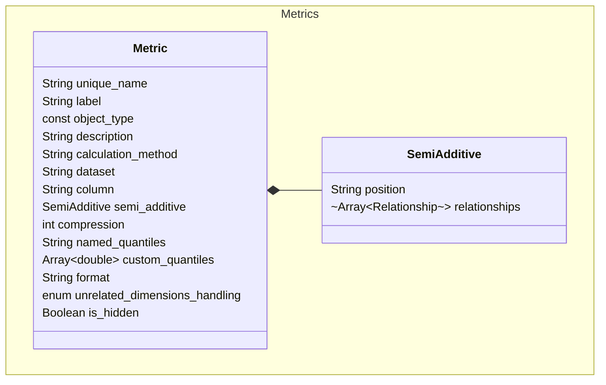

# Metric

Metric files define metrics to be used in your repository. A metric is a
numeric value representing a summarized (or aggregated) dataset metric,
such as the sum of sales or average order quantity. Metrics always
result from an aggregate calculation applied to one or more columns of a
fact dataset.

SML supports the following types of metrics:

- **Additive:** Metrics whose values can be summarized for any dimension
  attribute of the model and then combined consistently.
- **Non-additive:** Metrics whose values cannot be summed across any
  dimensional groupings using basic addition, since this would typically
  produce an inaccurate result. The most common example of a
  non-additive metric is a distinct count of an attribute value.
- **Semi-additive:** Metrics whose values can be summarized for some
  dimensions in a model, but not all. Ratios such as average are also
  considered semi-additive metrics.

Sample `metric` file:

```
unique_name: m_catalog_sales_coupon_amount_avg
object_type: metric
label: Catalog Sales  Average Coupon Amount
calculation_method: average
dataset: catalog_sales
column: cs_sales_price
```

# Entity Relationships



# Metric Properties

## unique_name

- **Type:** string
- **Required** Y

The unique name of the metric. This must be unique across all
repositories and subrepositories.

## object_type

- **Type:** const
- **Required** Y

The type of object defined by the file. For metrics, the value of this
property must be `metric`.

## label

- **Type:** string
- **Required** Y

The name of the metric, as it appears in the consunmption tool. This value does not
need to be unique.

## calculation_method

- **Type:** string
- **Required** Y

The method used to aggregate query results for the metric.

Supported values:

- `average`
- `count distinct`
- `count non-null`
- `estimated count distinct`
- `maximum`
- `minimum`
- `percentile`
- `stddev_pop`
- `stddev_samp`
- `sum`
- `sum distinct`
- `var_pop`
- `var_samp`

The calculation method you can use depends on the type of metric you're
creating:

- **Semi-additive:** `average`, `sum`, `minimum`, `maximum`
- **Non-additive:** `count distinct`, `sum distinct`, `percentile`
- **Additive:** All other options

## dataset

- **Type:** string
- **Required:** Y

The source dataset that contains the column the metric is based on.

## column

- **Type:** column
- **Required:** Y

The specific column within the `dataset` that the metric is based on.

## description

- **Type:** string
- **Required** N

A description of the metric.

## semi_additive

- **Type:** object
- **Required** N

Defines the metric as a semi-additive metric.

`semi_additive` supports the following properties.

### position

- **Type:** string
- **Required:** Y

Determines whether the metric is First Non-Empty or Last Non-Empty.

Supported values:
- `first`
- `last`

### relationships

- **Type:** Array
- **Required:** Required if `degenerate_dimensions` is undefined; otherwise, it is optional. 

A list of the relationships connecting to the dimensional attributes whose values should not be summarized by the metric. You can define as many as needed in the list.

**Note:** This list should not include relationships to degenerate dimensions; those must be defined via the `degenerate_dimensions` property (see below).

Relationships to embedded dimensions must be defined as indented lists, whose subitems construct the path to the nested dimension:

```
position: first
relationships:
  - relationship1
  - relationship2
  - 
    - relationship3
    - relationship4
  - relationship5
```

In the above example, `relationship1`, `relationship2`, and `relationship5` all define relationships to attributes in first-level dimensions. The third item in the list defines the path to an embedded dimension, connected to the fact table via `relationship3` and `relationship4`.

**Note:** For semi-additive metrics that contain embedded dimensions, the following restrictions apply to the non-additive component of first non-empty/last non-empty value metrics:
- Only the leaf levels of the embedded dimension hierarchies can be referenced. Note that this does not restrict the ability to query at higher levels of the embedded dimension hierarchy.
- Embedded dimensions cannot be referenced via many-to-many relationships.
- Embedded dimensions cannot be referenced through a path that involves role-playing.


### degenerate_dimensions

- **Type:** Array
- **Required:** Required if `relationships` is undefined; otherwise, it is optional. 

A list of degenerate dimensions whose values should not be summarized. 

**Note:** This list must only include degenerate dimensions; non-degenerate dimensions must be defined via the `relationships` property (see above). 

Supported properties:

- `name`: String, required. The unique name of the degenerate dimension.
- `level`: String, required. The specific level within the degenerate dimension.

For example:

```
position: first
degenerate_dimensions:
  - name: dim1
    level: level1
  - name: dim2
    level: level2
```

## compression

- **Type:** number
- **Required:** N

Only for non-additive metrics using a `calulation_method` of
`percentile`. Defines the compression score the semantic engine uses when
estimating percentile values for query results.

You can specify a value 1 - 50,000.

Using a higher compression score yields more accurate query results but
requires more memory from the engine to process. You may need to run
tests to determine the right level of compression for your needs.


## named_quantiles

- **Type:** string
- **Required:** Required if `calculation_method` is `percentile`

Only for non-additive metrics using a `calulation_method` of
`percentile`. Defines the quantile to use for query results.

Supported values:

- `quartiles`
- `median`
- `deciles`

## format

- **Type:** string
- **Required:** N

The format in which query results are returned. You can use one of
SML's built-in named formats or a custom format string.

Supported named formats:

- `fixed`
- `general number`
- `none`
- `percent`
- `scientific`
- `standard`

Custom format strings should be in quotes and contain one to four
sections, separated by semicolons.

## unrelated_dimensions_handling

- **Type:** string
- **Required:** N

Determines how the semantic engine behaves when all of the following
conditions are true:

- A client queries a model that contains multiple fact datasets.
- The data in each fact dataset are at a different level of granularity
  than the data in the other fact datasets.
- The query references dimensions that are not related to the metrics
  being queried.

Supported values:

- `error`: Query Engine rejects the query and returns an error message.
- `empty`: Query Engine displays empty cells in the query results.
- `repeat`: In the query results, Query Engine repeats the values for the
  metric at a level of aggregation that is determined from the shared
  dimensions in the query.

## is_hidden

- **Type:** boolean
- **Required:** N

Determines whether the metric is visible in BI tools.
