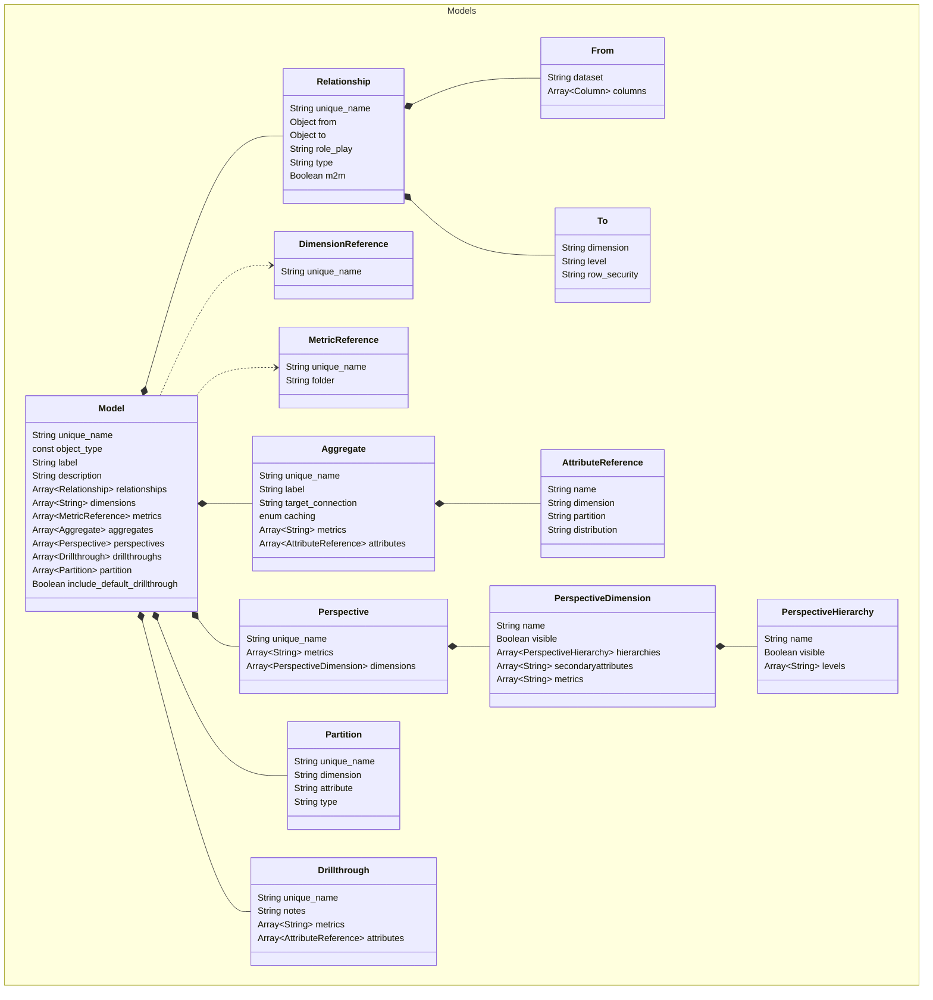

# Model

Model files define SML models. In SML, a model is a metadata
layer that overlays a multi-dimensional model format on top of the
datasets stored in a connected database. The model is virtual, meaning
the data is not moved or processed up front. Instead, it contains the
logic about how to process and optimize the data at query runtime.

**Note:** Some properties can appear in both `catalog.yml` and model
files. Those defined in model files override their counterparts in
`catalog.yml`.

Sample `model` file:

```
unique_name: Internet Sales
object_type: model
label: Internet Sales
visible: true

relationships:

  - unique_name: factinternetsales_Date_Dimension_Order
    from:
      dataset: factinternetsales
      join_columns:
        - orderdatekey
    to:
      dimension: Date Dimension
      level: DayMonth
    role_play: "Order {0}"

  - unique_name: factinternetsales_Date_Dimension_Ship
    from:
      dataset: factinternetsales
      join_columns:
        - shipdatekey
    to:
      dimension: Date Dimension
      level: DayMonth
    role_play: "Ship {0}"

  - unique_name: factinternetsales_Date_Dimension_Order_1
    from:
      dataset: factinternetsales
      join_columns:
        - orderdatekey
    to:
      dimension: Date Dimension
      level: Reporting_Day
    role_play: "Order {0}"

  - unique_name: factinternetsales_Date_Dimension_Ship_1
    from:
      dataset: factinternetsales
      join_columns:
        - shipdatekey
    to:
      dimension: Date Dimension
      level: Reporting_Day
    role_play: "Ship {0}"

  - unique_name: factinternetsales_Product_Dimension
    from:
      dataset: factinternetsales
      join_columns:
        - productkey
    to:
      dimension: Product Dimension
      level: Product Name

  - unique_name: factinternetsales_Order_Dimension
    from:
      dataset: factinternetsales
      join_columns:
        - salesorderlinenumber
        - salesordernumber
        - currencykey
    to:
      dimension: Order Dimension
      level: order_line_item

  - unique_name: factinternetsales_Date_Dimension_Order_2
    from:
      dataset: factinternetsales
      join_columns:
        - orderdatekey
    to:
      dimension: Date Dimension
      level: customday
    role_play: "Order {0}"

  - unique_name: factinternetsales_Date_Dimension_Ship_2
    from:
      dataset: factinternetsales
      join_columns:
        - shipdatekey
    to:
      dimension: Date Dimension
      level: customday
    role_play: "Ship {0}"

  - unique_name: factinternetsales_Customer_Dimension
    from:
      dataset: factinternetsales
      join_columns:
        - customerkey
    to:
      dimension: Customer Dimension
      level: Customer Name

dimensions:
  - Color Dimension
  - Size Dimension
  - Style Dimension
  - Weight

metrics:

  - unique_name: orderquantity
    folder: Sales Metrics

  - unique_name: salesamount
    folder: Sales Metrics

perspectives:
  - unique_name: Internet Sales - No PII
    dimensions:
      - hierarchies:
          - levels:
              - Customer Name
            name: Customer Hierarchy
        name: Customer Dimension
        secondaryattributes:
          - d_firstname
          - d_lastname

drillthroughs:

  - unique_name: Customer Details
    attributes:

      - name: State
        dimension: Geography Dimension

      - name: Customer Name
        dimension: Customer Dimension

      - name: City
        dimension: Geography Dimension

      - name: Zip Code
        dimension: Geography Dimension

    metrics:
      - orderquantity
      - salesamount

  - unique_name: Shipping Details
    attributes:

      - name: Size
        dimension: Size Dimension

      - name: Style
        dimension: Style Dimension

      - name: Color
        dimension: Color Dimension

      - name: Customer Name
        dimension: Customer Dimension

      - name: Product Name
        dimension: Product Dimension

    metrics:
      - orderquantity
      - salesamount
```

# Entity Relationships



# Model Properties

## unique_name

- **Type:** string
- **Required:** Y

The unique name of the model. This must be unique across all
repositories and subrepositories.

## object_type

- **Type:** const
- **Required:** Y

The type of object defined by the file. For models, the value of this
property should be `model`.

## label

- **Type:** string
- **Required:** Y

The name of the model, as it appears in the consunmption tool. This value does not
need to be unique.

## relationships

- **Type:** array
- **Required:** Y

Defines the relationships between the model's fact datasets and first
order dimensions. These are called fact relationships.

**Note:** These relationships are separate from those defined at the
dimension level: relationships at the model level involve fact datasets,
while those at the dimension level do not.

**Note:** Degenerate dimensions have relationships to the fact datasets on
which they are based. However, these dimensions do not need a
`relationships` property as they are created by referencing the fact
dataset columns directly.

If you do not want to add relationships to the model, the value of this
property must be `[]`. For example: `relationships: []`

The `relationships` property of a model file supports the following
properties.

### unique_name

- **Type:** string
- **Required:** Y

The unique name of the relationship. This must be unique within the
model file.

### from

- **Type:** object
- **Required:** Y

Defines the side of the relationship that contains the physical fact
dataset. Typically, this is a join column in the fact dataset.

Supported properties:

- `dataset`: String, required. The physical fact dataset you want to
  link to a dimension.
- `join_columns`: Array, required. The columns within the `dataset` that
  you want to use as join columns.

### to

- **Type:** object
- **Required:** Y

Defines the dimension that the `from` dataset is linked to.

Supported properties:

- `dimension`: String, required if `row_security` is undefined. The name
  of the dimension to which the `from` dataset is joined.
- `level`: String, required if `row_security` is undefined. The
  `unique_name` of the level attribute within the `dimension` to use for
  the relationship.
- `row_security`: String, required if `dimension` and `level` are
  undefined. For security relationships, the row
  security object that the `from` dataset is joined to.

### role_play

- **Type:** string
- **Required:** N

For role-playing relationships only. Defines the role-playing template
for the relationship.

The role-playing template is the prefix and/or suffix that is added to
every attribute in the role-played dimension.

This value must be in one of the following formats (including quotation
marks):

- **Prefix:** `"<prefix> {0}"`
- **Suffix:** `"{0} <suffix>"`
- **Prefix and suffix:** `"<prefix> {0} <suffix>"`

For example, if you wanted to use the prefix **Order**, you would set
`role_play` to `"Order {0}"`.

## metrics

- **Type:** array
- **Required:** Y

A list of references to metrics and calculations used in the model.

Supported properties:

- `unique_name`: String, required. The unique name of the metric or
  calculation.
- `folder`: String, optional. The name of the folder in which the
  metric/calculation is displayed in BI tools. If your model has a lot
  of metrics/calculations, folders are a good way to organize them.

**Note:** If you do not want to add metrics to the model, the value of
this property must be `[]`. For example: `metrics: []`

## description

- **Type:** string
- **Required:** N

A description of the model.

## dimensions

- **Type:** array
- **Required:** N

A list of references to degenerate dimensions defined on a specific fact
dataset in the model.

## perspectives

- **Type:** array
- **Required:** N

Perspectives are deployable subsets of the data model. They are meant to
make it easier for analysts to query only the subset of data that is
relevant to their purposes or responsibilities. Rather than provide
analysts with the entire data model, you can make specific dimensions,
hierarchies, levels, secondary attributes, measures, and calculated
measures invisible to them.

**Note:** We recommend that you add perspectives *after* a model has
been fully tested. Although you can edit a model after adding
perspectives, any changes might require you to update the perspectives
to hide new objects that would otherwise be visible to all users.

The semantic engine imposes no limit on the number of perspectives that
you can add to a model. Perspectives contain no data themselves, but are
simply virtual views of the data.

The `perspectives` property in a model file supports the following
properties.

### unique_name

- **Type:** string
- **Required:** Y

The unique name of the perspective. This must be unique within the model
file.

### metrics

- **Type:** array
- **Required:** N

A list of the specific metrics and calculations available in the
perspective.

### dimensions

- **Type:** array
- **Required:** N

A list of the specific dimensions and their hierarchies available in the
perspective.

By default, all objects within a dimension are visible. Hiding a level
in a hierarchy hides all levels below it, as well as their secondary
attributes.

Supported properties:

- `name`: String, required. The name of the dimension to include in the
  perspective.

- `prefixes`: Array, optional.

- `hierarchies`: Array, optional. A list of the specific hierarchies
  within the `name` dimension to include in the perspective. Supported
  properties:
- `name`: String, required. The name of the hierarchy.
- `levels`: Array, optional. A list of the levels within the
  hierarchy to include in the perspective.

- `secondaryattributes`: Array, optional. A list of the dimension's
  secondary attributes to include in the perspective.

## drillthroughs

- **Type:** array
- **Required:** N

In BI tools, a drillthrough enables you to view detailed information
about a specific cell within a visualization as needed. This provides an
alternative to including lots of fine-grained attributes in large pivot
tables, which can result in performance issues. Moving these attributes
to drillthroughs means they are only returned if a user requests them
for a specific cell, rather than for the entire table.

In an SML model, you can define drillthroughs that include the specific
level of detail to return for these types of queries.

The `drillthroughs` property in a model file supports the following
properties.

### unique_name

- **Type:** string
- **Required:** Y

The unique name of the drillthrough. This must be unique within the
model file.

### metrics

- **Type:** array
- **Required:** Y

A list of the metrics to include in the drillthrough.

### notes

- **Type:** string
- **Required:** N

Notes about the drillthrough.

### attributes

- **Type:** array
- **Required:** N

A list of the specific attributes to include in the drillthrough.

Supported properties:

- `name`: String, required. The name of the attribute to include in the
  drillthrough.
- `dimension`: String, optional. The dimension that the attribute
  defined by `name` appears in.

## aggregates

- **Type:** array
- **Required:** N

The `aggregates` property in a model file enables you to add
user-defined aggregates (UDAs).

In general, we recommend relying on the aggregate tables
automatically generated by the semantic engine. However, there are cases
that are not covered by system-defined aggregates. For example:

- **Metrics on dimensions:** The semantic engine does not generate
  aggregate tables for metrics that are local to a dimension only (a
  secondary metrical attribute in the model).
- **Non-additive metrics:** The semantic engine does not generate
  aggregate tables for non-additive metrics, which are useful for
  distinct counts. This is because such an aggregate table defined for
  one query would not be usable by other queries.

If you require aggregate tables that contain these types of dimensional
attributes or metrics, you should define your own manually using the
`aggregates` property.

The `aggregates` property in a model file supports the following
properties.

### unique_name

- **Type:** string
- **Required:** Y

The unique name of the aggregate. This must be unique within the model
file.

Aggregate table names used by the query engine are system-generated, but
they include the first 14 characters of the user-supplied name at the
end of the internal ID name. This name can help you identify when a
user-defined aggregate is used in a query. For example:
`as_agg_internal-id_my-uda-name`

### label

- **Type:** string
- **Required:** Y

The name of the aggregate, as it appears in the consunmption tool. This value does not
need to be unique.

### target_connection

- **Type:** string
- **Required:** Y

The database that the semantic engine writes the aggregate table to.

### caching

- **Type:** enum
- **Required:** N

This setting will control whether the aggregate is pinned in local cache.

Supported values:

- `engine-memory`

### metrics

- **Type:** array
- **Required:** Y

A list of the metrics and calculations to include in the aggregate
definition. This is the data that is summarized in the resulting
aggregate table.

### attributes

- **Type:** array
- **Required:** N

A list of the dimension attributes to include in the aggregate
definition.

Supported properties:

- `name`: String, required. The name of the dimension attribute to
  include. These values are used to group the summarized metric data in
  the resulting aggregate table. Note that user-defined aggregate
  definitions are fixed: they do not include every level of a hierarchy
  unless they are explicitly defined.

- `dimension`: String, required. The dimension to which the attribute
  defined by `name` belongs.

- `partition`: String, optional. Adds a partition to the aggregate, and
  determines whether it should be defined on the key column, name
  column, or both. Supported values:
- `name`

- `key`

- `name+key`

  > When the engine builds an instance of this aggregate, it creates
  > a partition for each combination of values in the dimensional
  > attributes. The number of partitions depends on the
  > left-to-right order of the attributes, as well as the number of
  > values for each attribute.
  >
  > Essentially, the partitioning key functions as a `GROUP BY`
  > column. Queries against the aggregate must use this dimensional
  > attribute in a `WHERE` clause. A good candidate for a
  > partitioning key is a set of dimensional attributes that
  > together have a few hundred to under 1000 value combinations.

- `distribution`: String, optional. The distribution keys to use when
  creating the aggregate table. If your aggregate data warehouse
  supports distribution keys, then the semantic engine uses the specified keys when
  creating the aggregate table. 

## partitions

- **Type:** array
- **Required:** N

The `partitions` property in a model file enables you to create
prioritized partitioning hints that the semantic engine uses to create
partitioned aggregate tables. The actual partitioning scheme used by the
engine depends on a number of factors, including:

- Whether the aggregate includes a column that matches a partition hint.
- Whether the semantic engine statistics suggest that partitioning would be
  worthwhile.
- Whether the target data warehouse supports table partitioning.

Within SML, all partitions used in a model are defined in the model file
itself.

The `partitions` property in a model supports the following properties.

### unique_name

- **Type:** string
- **Required:** Y

The unique name of the partition. This must be unique within the model
file.

### dimension

- **Type:** string
- **Required:** Y

The dimension that contains the `attribute` the partition is based on.

### attribute

- **Type:** string
- **Required:** Y

The attribute that the partition is based on.

### type

- **Type:** string
- **Required:** Y

Determines whether the partition is defined on the name column, key
column, or both.

Supported values:

- `name`
- `key`
- `name+key`

## dataset_properties

- **Type:** object
- **Required:** N

Defines dataset properties that are specific to the model, rather than
the repository.

Supported properties:

- `allow_aggregates`: Boolean, optional. Enables the semantic engine to
  create aggregates for datasets in the repository.
- `allow_local_aggs`: Boolean, optional. Enables local aggregation for
  datasets in the repository.
- `allow_peer_aggs`: Boolean, optional. Enables aggregation on data
  derived from datasets in data warehouses that are different from the
  source dataset.
- `create_hinted_aggregate`: Boolean, options. Enables the creation of
  hinted aggregates for the dataset.

Specify the name of the dataset followed by the properties and values
you want to set for it at the model level. For example:

    dataset1:
        create_hinted_aggregate: true
