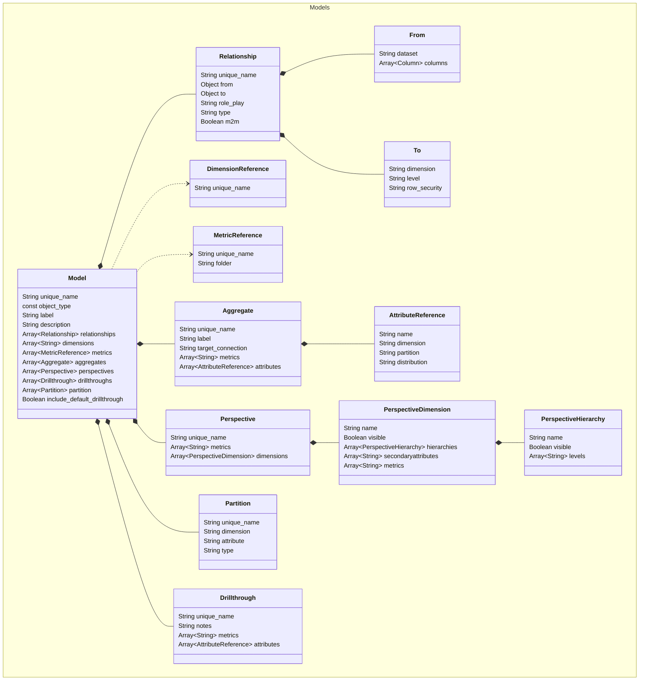

# Models

Model files define SML models. In SML, a model is a metadata
layer that overlays a multi-dimensional model format on top of the
datasets stored in a connected database. The model is virtual, meaning
the data is not moved or processed up front. Instead, it contains the
logic about how to process and optimize the data at query runtime.

:::note
*Note:* Some properties can appear in both `catalog.yml` and model
files. Those defined in model files override their counterparts in
`catalog.yml`.
:::

Sample `model` file:

```
unique_name: TPC-DS Benchmark Model
object_type: model
label: TPC-DS Benchmark Model
include_default_drillthrough: true

relationships:

  - unique_name: purchase_by_channel_Customer_Dimension
    from:
      dataset: purchase_by_channel
      join_columns:
        - customer_sk
    to:
      dimension: Customer Dimension - TPC-DS
      level: Customer Dimension - TPC-DS

  - unique_name: catalog_sales_Date_Dimension_Sold
    from:
      dataset: catalog_sales
      join_columns:
        - cs_sold_date_sk
    to:
      dimension: Date Dimension - TPC-DS
      level: Date Week Hierarchy - TPC-DS
    role_play: "Sold {0}"

  - unique_name: catalog_sales_Date_Dimension_Ship
    from:
      dataset: catalog_sales
      join_columns:
        - cs_ship_date_sk
    to:
      dimension: Date Dimension - TPC-DS
      level: Date Week Hierarchy - TPC-DS
    role_play: "Ship {0}"

  - unique_name: catalog_sales_Fulfilling_Warehouse
    from:
      dataset: catalog_sales
      join_columns:
        - cs_warehouse_sk
    to:
      dimension: Fulfilling Warehouse
      level: Fulfilling Warehouse

  - unique_name: catalog_sales_Time_Dimension_Sold
    from:
      dataset: catalog_sales
      join_columns:
        - cs_sold_time_sk
    to:
      dimension: Time Dimension
      level: Time
    role_play: "Sold {0}"

  - unique_name: catalog_sales_Promotions
    from:
      dataset: catalog_sales
      join_columns:
        - cs_promo_sk
    to:
      dimension: Promotions
      level: Promotions

  - unique_name: catalog_sales_Customer_Address_Sold
    from:
      dataset: catalog_sales
      join_columns:
        - cs_bill_addr_sk
    to:
      dimension: Customer Address
      level: Customer Address
    role_play: "Sold {0}"

  - unique_name: catalog_sales_Customer_Address
    from:
      dataset: catalog_sales
      join_columns:
        - cs_ship_addr_sk
    to:
      dimension: Customer Address
      level: Customer Address

  - unique_name: catalog_sales_Date_Dimension_Sold_1
    from:
      dataset: catalog_sales
      join_columns:
        - cs_sold_date_sk
    to:
      dimension: Date Dimension - TPC-DS
      level: Time Dimension
    role_play: "Sold {0}"

  - unique_name: catalog_sales_Date_Dimension_Ship_1
    from:
      dataset: catalog_sales
      join_columns:
        - cs_ship_date_sk
    to:
      dimension: Date Dimension - TPC-DS
      level: Time Dimension
    role_play: "Ship {0}"

  - unique_name: catalog_sales_Customer_Demographics
    from:
      dataset: catalog_sales
      join_columns:
        - cs_bill_cdemo_sk
    to:
      dimension: Customer Demographics
      level: Customer Demographics

  - unique_name: catalog_sales_Ship_Mode
    from:
      dataset: catalog_sales
      join_columns:
        - cs_ship_mode_sk
    to:
      dimension: Ship Mode
      level: Ship Mode

  - unique_name: catalog_sales_Household_Demographics
    from:
      dataset: catalog_sales
      join_columns:
        - cs_ship_customer_sk
    to:
      dimension: Household Demographics
      level: Household Demographics

  - unique_name: catalog_sales_Customer_Dimension
    from:
      dataset: catalog_sales
      join_columns:
        - cs_bill_customer_sk
    to:
      dimension: Customer Dimension - TPC-DS
      level: Customer Dimension - TPC-DS

  - unique_name: catalog_sales_Product_Dimension
    from:
      dataset: catalog_sales
      join_columns:
        - cs_item_sk
    to:
      dimension: Product Dimension - TPC-DS
      level: Product Dimension - TPC-DS

  - unique_name: store_promotion_Store_Dimension
    from:
      dataset: store_promotion
      join_columns:
        - ss_store_sk
    to:
      dimension: Store Dimension
      level: Store Dimension

  - unique_name: store_promotion_Date_Dimension_Sold
    from:
      dataset: store_promotion
      join_columns:
        - ss_sold_date_sk
    to:
      dimension: Date Dimension - TPC-DS
      level: Date Week Hierarchy - TPC-DS
    role_play: "Sold {0}"

  - unique_name: store_promotion_Promotions
    from:
      dataset: store_promotion
      join_columns:
        - p_promo_sk
    to:
      dimension: Promotions
      level: Promotions

  - unique_name: store_promotion_Customer_Address
    from:
      dataset: store_promotion
      join_columns:
        - ss_addr_sk
    to:
      dimension: Customer Address
      level: Customer Address

  - unique_name: store_promotion_Date_Dimension_Sold_1
    from:
      dataset: store_promotion
      join_columns:
        - ss_sold_date_sk
    to:
      dimension: Date Dimension - TPC-DS
      level: Time Dimension
    role_play: "Sold {0}"

  - unique_name: store_promotion_Customer_Demographics
    from:
      dataset: store_promotion
      join_columns:
        - ss_cdemo_sk
    to:
      dimension: Customer Demographics
      level: Customer Demographics

  - unique_name: store_promotion_Household_Demographics
    from:
      dataset: store_promotion
      join_columns:
        - ss_hdemo_sk
    to:
      dimension: Household Demographics
      level: Household Demographics

  - unique_name: store_promotion_Customer_Dimension
    from:
      dataset: store_promotion
      join_columns:
        - ss_customer_sk
    to:
      dimension: Customer Dimension - TPC-DS
      level: Customer Dimension - TPC-DS

  - unique_name: store_promotion_Product_Dimension
    from:
      dataset: store_promotion
      join_columns:
        - p_item_sk
    to:
      dimension: Product Dimension - TPC-DS
      level: Product Dimension - TPC-DS

  - unique_name: store_promotion_Product_Dimension_1
    from:
      dataset: store_promotion
      join_columns:
        - ss_item_sk
    to:
      dimension: Product Dimension - TPC-DS
      level: Product Dimension - TPC-DS

  - unique_name: web_sales_Date_Dimension_Sold
    from:
      dataset: web_sales
      join_columns:
        - ws_sold_date_sk
    to:
      dimension: Date Dimension - TPC-DS
      level: Date Week Hierarchy - TPC-DS
    role_play: "Sold {0}"

  - unique_name: web_sales_Date_Dimension_Ship
    from:
      dataset: web_sales
      join_columns:
        - ws_ship_date_sk
    to:
      dimension: Date Dimension - TPC-DS
      level: Date Week Hierarchy - TPC-DS
    role_play: "Ship {0}"

  - unique_name: web_sales_Fulfilling_Warehouse
    from:
      dataset: web_sales
      join_columns:
        - ws_warehouse_sk
    to:
      dimension: Fulfilling Warehouse
      level: Fulfilling Warehouse

  - unique_name: web_sales_Time_Dimension_Sold
    from:
      dataset: web_sales
      join_columns:
        - ws_sold_time_sk
    to:
      dimension: Time Dimension
      level: Time
    role_play: "Sold {0}"

  - unique_name: web_sales_Promotions
    from:
      dataset: web_sales
      join_columns:
        - ws_promo_sk
    to:
      dimension: Promotions
      level: Promotions

  - unique_name: web_sales_Customer_Address_Sold
    from:
      dataset: web_sales
      join_columns:
        - ws_bill_addr_sk
    to:
      dimension: Customer Address
      level: Customer Address
    role_play: "Sold {0}"

  - unique_name: web_sales_Customer_Address
    from:
      dataset: web_sales
      join_columns:
        - ws_ship_addr_sk
    to:
      dimension: Customer Address
      level: Customer Address

  - unique_name: web_sales_Date_Dimension_Sold_1
    from:
      dataset: web_sales
      join_columns:
        - ws_sold_date_sk
    to:
      dimension: Date Dimension - TPC-DS
      level: Time Dimension
    role_play: "Sold {0}"

  - unique_name: web_sales_Date_Dimension_Ship_1
    from:
      dataset: web_sales
      join_columns:
        - ws_ship_date_sk
    to:
      dimension: Date Dimension - TPC-DS
      level: Time Dimension
    role_play: "Ship {0}"

  - unique_name: web_sales_Customer_Demographics
    from:
      dataset: web_sales
      join_columns:
        - ws_bill_cdemo_sk
    to:
      dimension: Customer Demographics
      level: Customer Demographics

  - unique_name: web_sales_Ship_Mode
    from:
      dataset: web_sales
      join_columns:
        - ws_ship_mode_sk
    to:
      dimension: Ship Mode
      level: Ship Mode

  - unique_name: web_sales_Household_Demographics
    from:
      dataset: web_sales
      join_columns:
        - ws_bill_hdemo_sk
    to:
      dimension: Household Demographics
      level: Household Demographics

  - unique_name: web_sales_Customer_Dimension
    from:
      dataset: web_sales
      join_columns:
        - ws_bill_customer_sk
    to:
      dimension: Customer Dimension - TPC-DS
      level: Customer Dimension - TPC-DS

  - unique_name: web_sales_Product_Dimension
    from:
      dataset: web_sales
      join_columns:
        - ws_item_sk
    to:
      dimension: Product Dimension - TPC-DS
      level: Product Dimension - TPC-DS

  - unique_name: store_returns_Store_Dimension
    from:
      dataset: store_returns
      join_columns:
        - sr_store_sk
    to:
      dimension: Store Dimension
      level: Store Dimension

  - unique_name: store_returns_Date_Dimension_Return
    from:
      dataset: store_returns
      join_columns:
        - sr_returned_date_sk
    to:
      dimension: Date Dimension - TPC-DS
      level: Date Week Hierarchy - TPC-DS
    role_play: "Return {0}"

  - unique_name: store_returns_Time_Dimension_Return
    from:
      dataset: store_returns
      join_columns:
        - sr_return_time_sk
    to:
      dimension: Time Dimension
      level: Time
    role_play: "Return {0}"

  - unique_name: store_returns_Customer_Address
    from:
      dataset: store_returns
      join_columns:
        - sr_addr_sk
    to:
      dimension: Customer Address
      level: Customer Address

  - unique_name: store_returns_Date_Dimension_Return_1
    from:
      dataset: store_returns
      join_columns:
        - sr_returned_date_sk
    to:
      dimension: Date Dimension - TPC-DS
      level: Time Dimension
    role_play: "Return {0}"

  - unique_name: store_returns_Customer_Demographics
    from:
      dataset: store_returns
      join_columns:
        - sr_cdemo_sk
    to:
      dimension: Customer Demographics
      level: Customer Demographics

  - unique_name: store_returns_Household_Demographics
    from:
      dataset: store_returns
      join_columns:
        - sr_hdemo_sk
    to:
      dimension: Household Demographics
      level: Household Demographics

  - unique_name: store_returns_Customer_Dimension
    from:
      dataset: store_returns
      join_columns:
        - sr_customer_sk
    to:
      dimension: Customer Dimension - TPC-DS
      level: Customer Dimension - TPC-DS

  - unique_name: store_returns_Product_Dimension
    from:
      dataset: store_returns
      join_columns:
        - sr_item_sk
    to:
      dimension: Product Dimension - TPC-DS
      level: Product Dimension - TPC-DS

  - unique_name: store_sales_Store_Dimension
    from:
      dataset: store_sales
      join_columns:
        - ss_store_sk
    to:
      dimension: Store Dimension
      level: Store Dimension

  - unique_name: store_sales_Date_Dimension_Sold
    from:
      dataset: store_sales
      join_columns:
        - ss_sold_date_sk
    to:
      dimension: Date Dimension - TPC-DS
      level: Date Week Hierarchy - TPC-DS
    role_play: "Sold {0}"

  - unique_name: store_sales_Time_Dimension_Sold
    from:
      dataset: store_sales
      join_columns:
        - ss_sold_time_sk
    to:
      dimension: Time Dimension
      level: Time
    role_play: "Sold {0}"

  - unique_name: store_sales_Promotions
    from:
      dataset: store_sales
      join_columns:
        - ss_promo_sk
    to:
      dimension: Promotions
      level: Promotions

  - unique_name: store_sales_Customer_Address_Sold
    from:
      dataset: store_sales
      join_columns:
        - ss_addr_sk
    to:
      dimension: Customer Address
      level: Customer Address
    role_play: "Sold {0}"

  - unique_name: store_sales_Date_Dimension_Sold_1
    from:
      dataset: store_sales
      join_columns:
        - ss_sold_date_sk
    to:
      dimension: Date Dimension - TPC-DS
      level: Time Dimension
    role_play: "Sold {0}"

  - unique_name: store_sales_Customer_Demographics
    from:
      dataset: store_sales
      join_columns:
        - ss_cdemo_sk
    to:
      dimension: Customer Demographics
      level: Customer Demographics

  - unique_name: store_sales_Household_Demographics
    from:
      dataset: store_sales
      join_columns:
        - ss_hdemo_sk
    to:
      dimension: Household Demographics
      level: Household Demographics

  - unique_name: store_sales_Customer_Dimension
    from:
      dataset: store_sales
      join_columns:
        - ss_customer_sk
    to:
      dimension: Customer Dimension - TPC-DS
      level: Customer Dimension - TPC-DS

  - unique_name: store_sales_Product_Dimension
    from:
      dataset: store_sales
      join_columns:
        - ss_item_sk
    to:
      dimension: Product Dimension - TPC-DS
      level: Product Dimension - TPC-DS

  - unique_name: inventory_Date_Dimension_Inventory
    from:
      dataset: inventory
      join_columns:
        - inv_date_sk
    to:
      dimension: Date Dimension - TPC-DS
      level: Date Week Hierarchy - TPC-DS
    role_play: "Inventory {0}"

  - unique_name: inventory_Fulfilling_Warehouse
    from:
      dataset: inventory
      join_columns:
        - inv_warehouse_sk
    to:
      dimension: Fulfilling Warehouse
      level: Fulfilling Warehouse

  - unique_name: inventory_Date_Dimension_Inventory_1
    from:
      dataset: inventory
      join_columns:
        - inv_date_sk
    to:
      dimension: Date Dimension - TPC-DS
      level: Time Dimension
    role_play: "Inventory {0}"

  - unique_name: inventory_Product_Dimension
    from:
      dataset: inventory
      join_columns:
        - inv_item_sk
    to:
      dimension: Product Dimension - TPC-DS
      level: Product Dimension - TPC-DS

dimensions:
  - Catalog_Preferred
  - Catalog_Sales_Price_Tier
  - Net_Profit_Tier
  - Returns_Time_Tier
  - Sales_Price_Tier
  - Ss_Ticket_Number

metrics:

  - unique_name: m_catalog_sales_coupon_amount_avg
    folder: Catalog Sales Measures

  - unique_name: m_catalog_sales_list_price_avg
    folder: Catalog Sales Measures

  - unique_name: m_catalog_sales_net_paid_sum
    folder: Catalog Sales Measures

  - unique_name: m_catalog_sales_quantity_sold_avg
    folder: Catalog Sales Measures

  - unique_name: m_catalog_sales_sales_price_avg
    folder: Catalog Sales Measures

  - unique_name: m_catalog_sales_sum
    folder: Catalog Sales Measures

  - unique_name: m_cs row counter_sum
    folder: Catalog Sales Measures

  - unique_name: m_cs_bill_customer_sk_count
    folder: Customer Information

  - unique_name: m_cs_ext_discount_amt_sum
    folder: Catalog Sales Measures

  - unique_name: m_cs_ext_list_price_sum
    folder: Catalog Sales Measures

  - unique_name: m_cs_ext_sales_price_sum
    folder: Catalog Sales Measures

  - unique_name: m_cs_ext_tax_sum
    folder: Catalog Sales Measures

  - unique_name: m_cs_ext_wholesale_cost_sum
    folder: Catalog Sales Measures

  - unique_name: m_cs_net_paid_inc_tax_sum
    folder: Catalog Sales Measures

  - unique_name: m_cs_net_paid_sum
    folder: Catalog Sales Measures

  - unique_name: m_cs_net_profit_sum
    folder: Catalog Sales Measures

  - unique_name: m_cs_quantity_sum
    folder: Catalog Sales Measures

  - unique_name: m_cs_sales_price_sum
    folder: Catalog Sales Measures

  - unique_name: m_inventory_quantity_on_hand_sum
    folder: Inventory

  - unique_name: m_purchased_amount_in_catalog
    folder: Catalog Sales Measures

  - unique_name: m_purchased_amount_in_store
    folder: Store Sales Measures

  - unique_name: m_purchased_amount_on_web
    folder: Web Sales Measures

  - unique_name: m_returns_count_sum
    folder: Store Sales Measures

  - unique_name: m_ss row counter_sum
    folder: Store Sales Measures

  - unique_name: m_ss_coupon_amt_avg
    folder: Store Sales Measures

  - unique_name: m_ss_customer_sk_count
    folder: Customer Information

  - unique_name: m_ss_ext_discount_amt_sum
    folder: Store Sales Measures

  - unique_name: m_ss_ext_list_price_sum
    folder: Store Sales Measures

  - unique_name: m_ss_ext_sales_price_avg
    folder: Store Sales Measures

  - unique_name: m_ss_ext_sales_price_promotion
    folder: Store Sales Measures

  - unique_name: m_ss_ext_sales_price_sum
    folder: Store Sales Measures

  - unique_name: m_ss_ext_tax_sum
    folder: Store Sales Measures

  - unique_name: m_ss_ext_wholesale_cost_avg
    folder: Store Sales Measures

  - unique_name: m_ss_ext_wholesale_cost_sum
    folder: Store Sales Measures

  - unique_name: m_ss_list_price_avg
    folder: Store Sales Measures

  - unique_name: m_ss_net_paid_inc_tax_sum
    folder: Store Sales Measures

  - unique_name: m_ss_net_paid_sum
    folder: Store Sales Measures

  - unique_name: m_ss_net_profit_sum
    folder: Store Sales Measures

  - unique_name: m_ss_quantity_avg
    folder: Store Sales Measures

  - unique_name: m_ss_quantity_sum
    folder: Store Sales Measures

  - unique_name: m_ss_sales_price_avg
    folder: Store Sales Measures

  - unique_name: m_store_coupon_amt_sum
    folder: Store Sales Measures

  - unique_name: m_store_sales_price
    folder: Store Sales Measures

  - unique_name: m_web_sales_net_paid
    folder: Web Sales Measures

  - unique_name: m_web_sales_sum
    folder: Web Sales Measures

  - unique_name: m_ws row counter_sum
    folder: Web Sales Measures

  - unique_name: m_ws_bill_customer_sk_count
    folder: Customer Information

  - unique_name: m_ws_ext_discount_amt_sum
    folder: Web Sales Measures

  - unique_name: m_ws_ext_list_price_sum
    folder: Web Sales Measures

  - unique_name: m_ws_ext_sales_price_sum
    folder: Web Sales Measures

  - unique_name: m_ws_ext_ship_cost_sum
    folder: Web Sales Measures

  - unique_name: m_ws_ext_tax_sum
    folder: Web Sales Measures

  - unique_name: m_ws_ext_wholesale_cost_sum
    folder: Web Sales Measures

  - unique_name: m_ws_net_paid_inc_ship_sum
    folder: Web Sales Measures

  - unique_name: m_ws_net_paid_inc_ship_tax_sum
    folder: Web Sales Measures

  - unique_name: m_ws_net_paid_inc_tax_sum
    folder: Web Sales Measures

  - unique_name: m_ws_net_paid_sum
    folder: Web Sales Measures

  - unique_name: m_ws_net_profit_sum
    folder: Web Sales Measures

  - unique_name: m_ws_quantity_sum
    folder: Web Sales Measures

  - unique_name: Average Catalog Unit Net Profit
    folder: Catalog Sales Measures

  - unique_name: Average Store Unit Net Profit
    folder: Store Sales Measures

  - unique_name: Average Web Unit Net Profit
    folder: Web Sales Measures

  - unique_name: Avg Quarter Sales Ratio
    folder: Store Sales Measures

  - unique_name: Avg Quarterly Store Sales for 1998-1999
    folder: Store Sales Measures

  - unique_name: Catalog Buyer
    folder: Customer Information

  - unique_name: Catalog Purchased Amount Growth
    folder: Time Relative

  - unique_name: Catalog and Web Sales Net
    folder: Total Sales Measures

#  - unique_name: Catalog and Web Sales per Warehouse SqFt
#    folder: Total Sales Measures

  - unique_name: Catalog and Web Sales
    folder: Total Sales Measures

  - unique_name: Customer Count
    folder: Customer Information

  - unique_name: Revenue Ratio by Product Class
    folder: Store Sales Measures

  - unique_name: Sales by Promotion Ratio
    folder: Store Sales Measures

  - unique_name: Store Sales Increase
    folder: Store Sales Measures

  - unique_name: Store and Web Purchase Amount Growth
    folder: Time Relative

  - unique_name: Store and Web Purchased Amount
    folder: Time Relative

  - unique_name: Total  Ext Sales Price
    folder: Total Sales Measures

  - unique_name: Total Ext Discount Amount
    folder: Total Sales Measures

  - unique_name: Total Ext List Price
    folder: Total Sales Measures

  - unique_name: Total Ext Sales Tax
    folder: Total Sales Measures

  - unique_name: Total Ext Wholesale Cost
    folder: Total Sales Measures

  - unique_name: Total Net Paid Amount
    folder: Total Sales Measures

  - unique_name: Total Net Paid Incl Tax
    folder: Total Sales Measures

  - unique_name: Total Net Profit
    folder: Total Sales Measures

  - unique_name: Total Quantity Sold
    folder: Total Sales Measures

  - unique_name: Web Catalog Sales Price Growth
    folder: Time Relative

  - unique_name: Web Sales Increase
    folder: Web Sales Measures

  - unique_name: m_ws_cs_ext_sales_price_sum
    folder: Time Relative

aggregates:

   - unique_name: Q13
     label: Q13
     target_connection: Connection - TPCDS
     attributes:

       - name: d_hd_dep_count
         dimension: Household Demographics

       - name: d_cd_marital_status
         dimension: Customer Demographics

       - name: d_customer_state
         dimension: Customer Address
         relationships_path:
           - CustomerDimension_CustomerAddress

       - name: d_sales_price_tier
         dimension: Sales_Price_Tier

       - name: d_cd_education_status
         dimension: Customer Demographics

       - name: d_customer_country
         dimension: Customer Address
         relationships_path:
           - CustomerDimension_CustomerAddress

       - name: Calendar Year-Week
         dimension: Date Dimension - TPC-DS
         partition: name
         relationships_path:
           - store_sales_Date_Dimension_Sold

       - name: d_net_profit_tier
         dimension: Net_Profit_Tier

     metrics:
       - m_ss_ext_wholesale_cost_sum
       - m_ss_quantity_avg
       - m_ss_ext_wholesale_cost_avg
       - m_ss_ext_sales_price_avg

   - unique_name: Q15
     label: Q15
     target_connection: Connection - TPCDS
     attributes:

       - name: d_customer_state
         dimension: Customer Address
         relationships_path:
           - CustomerDimension_CustomerAddress

       - name: d_customer_zip_code
         dimension: Customer Address
         relationships_path:
           - CustomerDimension_CustomerAddress

       - name: Calendar Year
         dimension: Date Dimension - TPC-DS
         partition: name
         relationships_path:
           - store_sales_Date_Dimension_Sold_1

       - name: d_catalog_sales_price_tier
         dimension: Catalog_Sales_Price_Tier

       - name: d_quarter_of_year
         dimension: Date Dimension - TPC-DS
         relationships_path:
           - store_sales_Date_Dimension_Sold_1

     metrics:
       - m_cs_sales_price_sum

   - unique_name: Q2
     label: Q2
     target_connection: Connection - TPCDS
     attributes:

       - name: Calendar Week
         dimension: Date Dimension - TPC-DS
         relationships_path:
           - store_sales_Date_Dimension_Sold

       - name: d_day_name_week
         dimension: Date Dimension - TPC-DS
         relationships_path:
           - store_sales_Date_Dimension_Sold

       - name: d_week_seg
         dimension: Date Dimension - TPC-DS
         relationships_path:
           - store_sales_Date_Dimension_Sold

       - name: Calendar Year-Week
         dimension: Date Dimension - TPC-DS
         partition: name
         relationships_path:
           - store_sales_Date_Dimension_Sold

     metrics:
       - Web Catalog Sales Price Growth

   - unique_name: Q31
     label: Q31
     target_connection: Connection - TPCDS
     attributes:

       - name: Calendar Quarter
         dimension: Date Dimension - TPC-DS
         relationships_path:
           - store_sales_Date_Dimension_Sold_1

       - name: d_CA_COUNTY
         dimension: Customer Address
         relationships_path:
           - store_sales_Customer_Address_Sold

       - name: Calendar Year-Week
         dimension: Date Dimension - TPC-DS
         partition: name
         relationships_path:
           - store_sales_Date_Dimension_Sold

     metrics:
       - Web Sales Increase
       - Store Sales Increase

   - unique_name: Q33
     label: Q33
     target_connection: Connection - TPCDS
     attributes:

       - name: d_customer_gmt_offset
         dimension: Customer Address
         relationships_path:
           - store_sales_Customer_Address_Sold

       - name: d_month_of_year
         dimension: Date Dimension - TPC-DS
         relationships_path:
           - store_sales_Date_Dimension_Sold_1

       - name: I category
         dimension: Product Dimension - TPC-DS

       - name: d_product_manufacturer_id
         dimension: Product Dimension - TPC-DS

       - name: Calendar Year-Week
         dimension: Date Dimension - TPC-DS
         partition: name
         relationships_path:
           - store_sales_Date_Dimension_Sold

     metrics:
       - Total  Ext Sales Price

   - unique_name: Q42
     label: Q42
     target_connection: Connection - TPCDS
     attributes:

       - name: d_month_of_year
         dimension: Date Dimension - TPC-DS
         relationships_path:
           - store_sales_Date_Dimension_Sold_1

       - name: I category
         dimension: Product Dimension - TPC-DS

       - name: d_product_manager_id
         dimension: Product Dimension - TPC-DS

       - name: Calendar Year-Week
         dimension: Date Dimension - TPC-DS
         partition: name
         relationships_path:
           - store_sales_Date_Dimension_Sold

     metrics:
       - m_ss_ext_sales_price_sum

   - unique_name: Q48
     label: Q48
     target_connection: Connection - TPCDS
     attributes:

       - name: d_cd_marital_status
         dimension: Customer Demographics

       - name: d_customer_state
         dimension: Customer Address
         relationships_path:
           - store_sales_Customer_Address_Sold

       - name: d_sales_price_tier
         dimension: Sales_Price_Tier

       - name: d_cd_education_status
         dimension: Customer Demographics

       - name: d_customer_country
         dimension: Customer Address
         relationships_path:
           - store_sales_Customer_Address_Sold

       - name: Calendar Year-Week
         dimension: Date Dimension - TPC-DS
         partition: name
         relationships_path:
           - store_sales_Date_Dimension_Sold

       - name: d_net_profit_tier
         dimension: Net_Profit_Tier

     metrics:
       - m_ss_quantity_sum

   - unique_name: Q50
     label: Q50
     target_connection: Connection - TPCDS
     attributes:

       - name: d_store_zip_code
         dimension: Store Dimension

       - name: d_store_country
         dimension: Store Dimension

       - name: d_store_street_type
         dimension: Store Dimension

       - name: d_store_city
         dimension: Store Dimension

       - name: d_month_of_year
         dimension: Date Dimension - TPC-DS
         relationships_path:
           - store_returns_Date_Dimension_Return_1

       - name: d_store_company_id
         dimension: Store Dimension

       - name: d_returns_time_tier
         dimension: Returns_Time_Tier

       - name: d_store_name
         dimension: Store Dimension

       - name: d_store_street_number
         dimension: Store Dimension

       - name: d_store_street_name
         dimension: Store Dimension

       - name: d_store_county
         dimension: Store Dimension

       - name: d_store_suite_number
         dimension: Store Dimension

       - name: Calendar Year-Week
         dimension: Date Dimension - TPC-DS
         partition: name
         relationships_path:
           - store_returns_Date_Dimension_Return

       - name: d_store_state
         dimension: Store Dimension

     metrics:
       - m_returns_count_sum

   - unique_name: Q52
     label: Q52
     target_connection: Connection - TPCDS
     attributes:

       - name: d_product_brand_name
         dimension: Product Dimension - TPC-DS

       - name: d_month_of_year
         dimension: Date Dimension - TPC-DS
         relationships_path:
           - store_sales_Date_Dimension_Sold_1

       - name: d_product_brand_id
         dimension: Product Dimension - TPC-DS

       - name: d_product_manager_id
         dimension: Product Dimension - TPC-DS

       - name: Calendar Year-Week
         dimension: Date Dimension - TPC-DS
         partition: name
         relationships_path:
           - store_sales_Date_Dimension_Sold

     metrics:
       - m_ss_ext_sales_price_sum

   - unique_name: Q53
     label: Q53
     target_connection: Connection - TPCDS
     attributes:

       - name: d_product_brand_name
         dimension: Product Dimension - TPC-DS

       - name: d_product_class_name
         dimension: Product Dimension - TPC-DS

       - name: I category
         dimension: Product Dimension - TPC-DS

       - name: Calendar Quarter
         dimension: Date Dimension - TPC-DS
         relationships_path:
           - store_sales_Date_Dimension_Sold_1

       - name: d_product_manufacturer_id
         dimension: Product Dimension - TPC-DS

     metrics:
       - Avg Quarterly Store Sales for 1998-1999
       - Avg Quarter Sales Ratio
       - m_store_sales_price

   - unique_name: Q56-Q60
     label: Q56-Q60
     target_connection: Connection - TPCDS
     attributes:

       - name: Calendar Year
         dimension: Date Dimension - TPC-DS
         partition: name
         relationships_path:
           - store_sales_Date_Dimension_Sold_1

       - name: d_product_item_id
         dimension: Product Dimension - TPC-DS

       - name: d_customer_gmt_offset
         dimension: Customer Address
         relationships_path:
           - CustomerDimension_CustomerAddress

       - name: d_month_of_year
         dimension: Date Dimension - TPC-DS
         relationships_path:
           - store_sales_Date_Dimension_Sold_1

       - name: I category
         dimension: Product Dimension - TPC-DS

       - name: d_i_color
         dimension: Product Dimension - TPC-DS

     metrics:
       - Total  Ext Sales Price

   - unique_name: Q61
     label: Q61
     target_connection: Connection - TPCDS
     attributes:

       - name: d_channel_direct_mail
         dimension: Promotions

       - name: d_store_gmt_offset
         dimension: Store Dimension

       - name: d_channel_tv
         dimension: Promotions

       - name: d_customer_gmt_offset
         dimension: Customer Address
         relationships_path:
           - CustomerDimension_CustomerAddress

       - name: d_month_of_year
         dimension: Date Dimension - TPC-DS
         relationships_path:
           - store_sales_Date_Dimension_Sold_1

       - name: I category
         dimension: Product Dimension - TPC-DS

       - name: d_channel_email
         dimension: Promotions

       - name: Calendar Year-Week
         dimension: Date Dimension - TPC-DS
         partition: name
         relationships_path:
           - store_sales_Date_Dimension_Sold

     metrics:
       - m_ss_ext_sales_price_sum
       - m_ss_ext_sales_price_promotion

   - unique_name: Q7-Q26
     label: Q7-Q26
     target_connection: Connection - TPCDS
     attributes:

       - name: d_cd_marital_status
         dimension: Customer Demographics

       - name: Calendar Year
         dimension: Date Dimension - TPC-DS
         partition: name
         relationships_path:
           - store_sales_Date_Dimension_Sold_1

       - name: d_product_item_id
         dimension: Product Dimension - TPC-DS

       - name: d_cd_education_status
         dimension: Customer Demographics

       - name: d_channel_event
         dimension: Promotions

       - name: d_cd_gender
         dimension: Customer Demographics

       - name: d_channel_email
         dimension: Promotions

     metrics:
       - m_catalog_sales_coupon_amount_avg
       - m_ss_sales_price_avg
       - m_catalog_sales_quantity_sold_avg
       - m_ss_coupon_amt_avg
       - m_ss_quantity_avg
       - m_ss_list_price_avg
       - m_catalog_sales_list_price_avg
       - m_catalog_sales_sales_price_avg

   - unique_name: Q88
     label: Q88
     target_connection: Connection - TPCDS
     attributes:

       - name: d_hd_dep_count
         dimension: Household Demographics

       - name: d_morning _time_tier
         dimension: Time Dimension
         relationships_path:
           - store_sales_Time_Dimension_Sold

       - name: d_hd_vehicle_count
         dimension: Household Demographics

       - name: d_store_name
         dimension: Store Dimension

     metrics:
       - m_ss row counter_sum

   - unique_name: Q96
     label: Q96
     target_connection: Connection - TPCDS
     attributes:

       - name: d_hd_dep_count
         dimension: Household Demographics

       - name: d_minute
         dimension: Time Dimension
         partition: name
         relationships_path:
           - store_sales_Time_Dimension_Sold

       - name: d_hour
         dimension: Time Dimension
         relationships_path:
           - store_sales_Time_Dimension_Sold

       - name: d_store_name
         dimension: Store Dimension

     metrics:
       - m_ss row counter_sum
 

partitions:

   - unique_name: TPC-DS Benchmark Model.Date Dimension - TPC-DS.Calendar Year.partition
     dimension: Date Dimension - TPC-DS
     attribute: Calendar Year
     type: key
     relationships_path:
       - store_sales_Date_Dimension_Sold_1

   - unique_name: TPC-DS Benchmark Model.Date Dimension - TPC-DS.Calendar Year-Week.partition
     dimension: Date Dimension - TPC-DS
     attribute: Calendar Year-Week
     type: key
     relationships_path:
       - store_sales_Date_Dimension_Sold
```

# Entity Relationships



# Model Properties

## unique_name

- **Type:** string
- **Required:** Y

The unique name of the model. This must be unique across all
repositories and subrepositories.

## object_type

- **Type:** const
- **Required:** Y

The type of object defined by the file. For models, the value of this
property should be `model`.

## label

- **Type:** string
- **Required:** Y

The name of the model, as it appears in the consunmption tool. This value does not
need to be unique.

## relationships

- **Type:** array
- **Required:** Y

Defines the relationships between the model's fact datasets and first
order dimensions. These are called fact relationships.

:::note
*Note:* These relationships are separate from those defined at the
dimension level: relationships at the model level involve fact datasets,
while those at the dimension level do not.
:::

:::note
*Note:* Degenerate dimensions have relationships to the fact datasets on
which they are based. However, these dimensions do not need a
`relationships` property as they are created by referencing the fact
dataset columns directly.
:::

If you do not want to add relationships to the model, the value of this
property must be `[]`. For example: `relationships: []`

The `relationships` property of a model file supports the following
properties.

### unique_name

- **Type:** string
- **Required:** Y

The unique name of the relationship. This must be unique within the
model file.

### from

- **Type:** object
- **Required:** Y

Defines the side of the relationship that contains the physical fact
dataset. Typically, this is a join column in the fact dataset.

Supported properties:

- `dataset`: String, required. The physical fact dataset you want to
  link to a dimension.
- `join_columns`: Array, required. The columns within the `dataset` that
  you want to use as join columns.

### to

- **Type:** object
- **Required:** Y

Defines the dimension that the `from` dataset is linked to.

Supported properties:

- `dimension`: String, required if `row_security` is undefined. The name
  of the dimension to which the `from` dataset is joined.
- `level`: String, required if `row_security` is undefined. The
  `unique_name` of the level attribute within the `dimension` to use for
  the relationship.
- `row_security`: String, required if `dimension` and `level` are
  undefined. For security relationships, the [row
  security](../../c-creating-and-sharing-cubes/sml-reference/row-security.md)
  object that the `from` dataset is joined to.

### role_play

- **Type:** string
- **Required:** N

For role-playing relationships only. Defines the role-playing template
for the relationship.

The role-playing template is the prefix and/or suffix that is added to
every attribute in the role-played dimension.

This value must be in one of the following formats (including quotation
marks):

- **Prefix:** `"<prefix> {0}"`
- **Suffix:** `"{0} <suffix>"`
- **Prefix and suffix:** `"<prefix> {0} <suffix>"`

For example, if you wanted to use the prefix **Order**, you would set
`role_play` to `"Order {0}"`.

## metrics

- **Type:** array
- **Required:** Y

A list of references to metrics and calculations used in the model.

Supported properties:

- `unique_name`: String, required. The unique name of the metric or
  calculation.
- `folder`: String, optional. The name of the folder in which the
  metric/calculation is displayed in BI tools. If your model has a lot
  of metrics/calculations, folders are a good way to organize them.

:::note
*Note:* If you do not want to add metrics to the model, the value of
this property must be `[]`. For example: `metrics: []`
:::

## description

- **Type:** string
- **Required:** N

A description of the model.

## dimensions

- **Type:** array
- **Required:** N

A list of references to degenerate dimensions defined on a specific fact
dataset in the model.

## perspectives

- **Type:** array
- **Required:** N

Perspectives are deployable subsets of the data model. They are meant to
make it easier for analysts to query only the subset of data that is
relevant to their purposes or responsibilities. Rather than provide
analysts with the entire data model, you can make specific dimensions,
hierarchies, levels, secondary attributes, measures, and calculated
measures invisible to them.

:::note
*Note:* We recommend that you add perspectives *after* a model has
been fully tested. Although you can edit a model after adding
perspectives, any changes might require you to update the perspectives
to hide new objects that would otherwise be visible to all users.
:::

The semantic engine imposes no limit on the number of perspectives that
you can add to a model. Perspectives contain no data themselves, but are
simply virtual views of the data.

For more information on perspectives, see [Modeling
Perspectives](../../c-creating-and-sharing-cubes/creating-cubes/modeling-perspectives/index.md).

The `perspectives` property in a model file supports the following
properties.

### unique_name

- **Type:** string
- **Required:** Y

The unique name of the perspective. This must be unique within the model
file.

### metrics

- **Type:** array
- **Required:** N

A list of the specific metrics and calculations available in the
perspective.

### dimensions

- **Type:** array
- **Required:** N

A list of the specific dimensions and their hierarchies available in the
perspective.

By default, all objects within a dimension are visible. Hiding a level
in a hierarchy hides all levels below it, as well as their secondary
attributes.

Supported properties:

- `name`: String, required. The name of the dimension to include in the
  perspective.

- `prefixes`: Array, optional.

- `hierarchies`: Array, optional. A list of the specific hierarchies
  within the `name` dimension to include in the perspective. Supported
  properties:
- `name`: String, required. The name of the hierarchy.
- `levels`: Array, optional. A list of the levels within the
  hierarchy to include in the perspective.

- `secondaryattributes`: Array, optional. A list of the dimension's
  secondary attributes to include in the perspective.

## drillthroughs

- **Type:** array
- **Required:** N

In BI tools, a drillthrough enables you to view detailed information
about a specific cell within a visualization as needed. This provides an
alternative to including lots of fine-grained attributes in large pivot
tables, which can result in performance issues. Moving these attributes
to drillthroughs means they are only returned if a user requests them
for a specific cell, rather than for the entire table.

In an SML model, you can define drillthroughs that include the specific
level of detail to return for these types of queries.

The `drillthroughs` property in a model file supports the following
properties.

### unique_name

- **Type:** string
- **Required:** Y

The unique name of the drillthrough. This must be unique within the
model file.

### metrics

- **Type:** array
- **Required:** Y

A list of the metrics to include in the drillthrough.

### notes

- **Type:** string
- **Required:** N

Notes about the drillthrough.

### attributes

- **Type:** array
- **Required:** N

A list of the specific attributes to include in the drillthrough.

Supported properties:

- `name`: String, required. The name of the attribute to include in the
  drillthrough.
- `dimension`: String, optional. The dimension that the attribute
  defined by `name` appears in.

## aggregates

- **Type:** array
- **Required:** N

The `aggregates` property in a model file enables you to add
user-defined aggregates (UDAs).

In general, we recommend relying on the aggregate tables
automatically generated by the semantic engine. However, there are cases
that are not covered by system-defined aggregates. For example:

- **Metrics on dimensions:** The semantic engine does not generate
  aggregate tables for metrics that are local to a dimension only (a
  secondary metrical attribute in the model).
- **Non-additive metrics:** The semantic engine does not generate
  aggregate tables for non-additive metrics, which are useful for
  distinct counts. This is because such an aggregate table defined for
  one query would not be usable by other queries.

If you require aggregate tables that contain these types of dimensional
attributes or metrics, you should define your own manually using the
`aggregates` property.

The `aggregates` property in a model file supports the following
properties.

### unique_name

- **Type:** string
- **Required:** Y

The unique name of the aggregate. This must be unique within the model
file.

Aggregate table names used by the query engine are system-generated, but
they include the first 14 characters of the user-supplied name at the
end of the internal ID name. This name can help you identify when a
user-defined aggregate is used in a query. For example:
`as_agg_internal-id_my-uda-name`

### label

- **Type:** string
- **Required:** Y

The name of the aggregate, as it appears in the consunmption tool. This value does not
need to be unique.

### target_connection

- **Type:** string
- **Required:** Y

The database that the semantic engine writes the aggregate table to.

### metrics

- **Type:** array
- **Required:** Y

A list of the metrics and calculations to include in the aggregate
definition. This is the data that is summarized in the resulting
aggregate table.

### attributes

- **Type:** array
- **Required:** N

A list of the dimension attributes to include in the aggregate
definition.

Supported properties:

- `name`: String, required. The name of the dimension attribute to
  include. These values are used to group the summarized metric data in
  the resulting aggregate table. Note that user-defined aggregate
  definitions are fixed: they do not include every level of a hierarchy
  unless they are explicitly defined.

- `dimension`: String, required. The dimension to which the attribute
  defined by `name` belongs.

- `partition`: String, optional. Adds a partition to the aggregate, and
  determines whether it should be defined on the key column, name
  column, or both. Supported values:
- `name`

- `key`

- `name+key`

  > When the engine builds an instance of this aggregate, it creates
  > a partition for each combination of values in the dimensional
  > attributes. The number of partitions depends on the
  > left-to-right order of the attributes, as well as the number of
  > values for each attribute.
  >
  > Essentially, the partitioning key functions as a `GROUP BY`
  > column. Queries against the aggregate must use this dimensional
  > attribute in a `WHERE` clause. A good candidate for a
  > partitioning key is a set of dimensional attributes that
  > together have a few hundred to under 1000 value combinations.

- `distribution`: String, optional. The distribution keys to use when
  creating the aggregate table. If your aggregate data warehouse
  supports distribution keys, then the semantic engine uses the specified keys when
  creating the aggregate table. 

## partitions

- **Type:** array
- **Required:** N

The `partitions` property in a model file enables you to create
prioritized partitioning hints that the semantic engine uses to create
partitioned aggregate tables. The actual partitioning scheme used by the
engine depends on a number of factors, including:

- Whether the aggregate includes a column that matches a partition hint.
- Whether the semantic engine statistics suggest that partitioning would be
  worthwhile.
- Whether the target data warehouse supports table partitioning.

Within SML, all partitions used in a model are defined in the model file
itself.

The `partitions` property in a model supports the following properties.

### unique_name

- **Type:** string
- **Required:** Y

The unique name of the partition. This must be unique within the model
file.

### dimension

- **Type:** string
- **Required:** Y

The dimension that contains the `attribute` the partition is based on.

### attribute

- **Type:** string
- **Required:** Y

The attribute that the partition is based on.

### type

- **Type:** string
- **Required:** Y

Determines whether the partition is defined on the name column, key
column, or both.

Supported values:

- `name`
- `key`
- `name+key`

## dataset_properties

- **Type:** object
- **Required:** N

Defines dataset properties that are specific to the model, rather than
the repository.

Supported properties:

- `allow_aggregates`: Boolean, optional. Enables the semantic engine to
  create aggregates for datasets in the repository.
- `allow_local_aggs`: Boolean, optional. Enables local aggregation for
  datasets in the repository.
- `allow_peer_aggs`: Boolean, optional. Enables aggregation on data
  derived from datasets in data warehouses that are different from the
  source dataset.
- `create_hinted_aggregate`: Boolean, options. Enables the creation of
  hinted aggregates for the dataset.

Specify the name of the dataset followed by the properties and values
you want to set for it at the model level. For example:

    dataset1:
        create_hinted_aggregate: true
