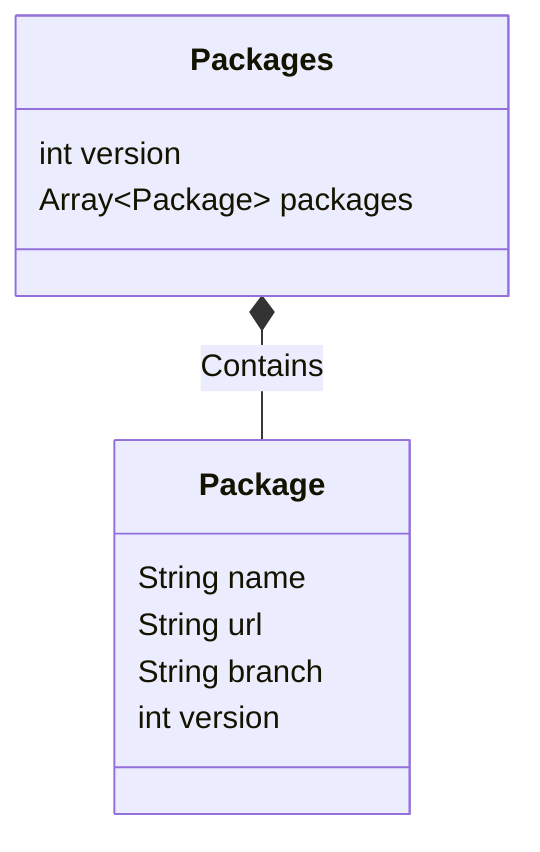

# Package

Package files enable you to define additional Git repositories whose
objects can be used in the current repository. This enables you to share
individual objects (such as dimensions) across multiple models.

Sample `package` file:

```
packages:
  - name: shared
    url: https://github.com/company/shared
    branch: main
    version: 'latest' # 'commit:f35ce2d975cee7c8d95f9e4c93ef4946089950fd', 'tag:v2024.01'
  - name: shared2
    url: https://github.com/company/shared2
    branch: main
    version: 'latest' # 'commit:f35ce2d975cee7c8d95f9e4c93ef4946089950fd', 'tag:v2024.01'
```

# Entitity Relationships



# Package Properties

## version

- **Type:** number
- **Required:** Y

The schema version for the file. The value of this property should be
`1`.

## packages

- **Type:** array
- **Required:** Y

A list of the Git repositories that the current repository can use
objects from.

`package` supports the following properties:

- `name`: String, required. The name of the repository.
- `url`: String, required. The URL for the repository.
- `branch`: String, required. The specific branch from the repository to
  use.
- `version`: String, required. The ID for a specific commit to use. This
  should begin with `commit:` followed by 8-40 alphanumeric characters.
